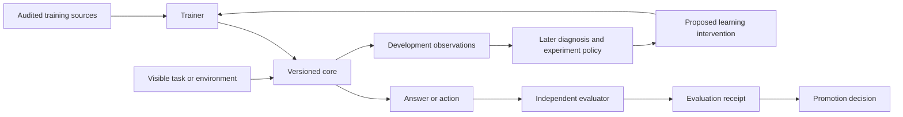

# BRAMASTRA: a first-principles research blueprint for An-Ra

**Overall design superseded by the [full AGI blueprint](AGI_BLUEPRINT.md), with detailed [Cymek](docs/bramastra/CYMEK_100X_ROADMAP.md) and [Citadel](docs/bramastra/CITADEL_100X_ROADMAP.md) roadmaps dated 2026-09-06. This document retains the initial bounded experiment plan and its historical decisions.**

Design date: 2026-09-05. Implementation update: 2026-09-06. The overall AGI design remains a research proposal; a bounded from-scratch instrument and development experiments now exist. See [results](docs/bramastra/RESULTS.md) and [the target research loop](docs/bramastra/RESEARCH_LOOP.md). Full B0/B1 campaigns have not run, and a learned discovery policy remains unimplemented.

The owner's objective is **AGI trained from scratch**, with approximately **100 hours of free Kaggle TPU access per week**. Those are the governing requirements. The hours are an owner-reported planning envelope; actual quota, device topology, and session duration must be measured. This proposal does not import pretrained weights.

This was the initial entry point for the BRAMASTRA design. Historical documents retain their historical meaning; their frozen choices do not bind the expanded proposal. Existing executable contracts are unchanged. Implementing a different experiment will require its own explicit manifest rather than silently changing an old experiment's meaning.

Read [the evidence audit](docs/bramastra/EVIDENCE.md) for what survived scrutiny and [the experiment plan](docs/bramastra/EXPERIMENTS.md) for execution order, budgets, and acceptance rules.

## 1. The central decision

Build an intelligence that learns to discover, choose experiments, and accumulate **successive, transferable improvements from scratch**. Its learned research loop is the destination; the initial experiments establish the prerequisites. Choose its eventual architecture by which bottlenecks actually obstruct that process.

There is no established recipe that guarantees AGI within this budget. A precise parameter count cannot close that uncertainty. We can make the next experiment decisive, accumulate evidence, and keep the larger hypothesis exposed to failure.

The first milestone is a learned computation that survives changes in wording, identities, positions, and task structure. Acquisition/retention experiments and an interactive observation-to-outcome testbed then support the central question: can a learned policy choose useful experiments better than simple alternatives? These milestones need not wait for a large language pretraining campaign. They are prerequisites toward the owner's goal, not a redefinition of AGI.

**My main departure from the earlier plans:** test whether the proposed learning signal produces transfer before optimizing vocabulary, depth, attention variants, or billion-token schedules. Software certification should protect a real experiment, not become its substitute.

## 2. What intelligence would require us to demonstrate

Use separate measurable hypotheses rather than assuming that benchmark binding is the essence of intelligence.

| Hypothesis | Observable evidence | What would not establish it |
|---|---|---|
| Context governs answers | Relevant changes alter correct answers; irrelevant changes preserve them | Copying the last value |
| Computations transfer | Held-out structures and independently authored natural tasks improve | New random seeds in the same template |
| Learning accumulates | Multiple sequential acquisitions retain earlier abilities on fresh tests | One fine-tune or unchanged average score |
| Diagnosis guides action | Before acting, a policy predicts which intervention helps, outperforming fixed and surface-only policies at equal cost | Plausible self-explanations or an always-negative predictor |
| Planning generalizes | New environments require selecting actions, maintaining state, recovering from errors, and managing a budget | Success with an answer-bearing tool or an oracle plan |
| Generality grows | Transfer across qualitatively different domains, tasks, and horizons with less task-specific engineering | A fixed synthetic curriculum mastered perfectly |

Track a vector of outcomes: unassisted task success, transfer, retention, learning cost, inference cost, and intervention usefulness. Do not collapse these into a convenient single intelligence score.

## 3. First principles and their consequences

**A learning signal must distinguish competing computations.** If recency or output frequency solves the training distribution, success provides little reason to expect query-sensitive behavior. Generate counterfactual groups in which facts are fixed and queries change, and other groups in which the relevant fact changes while the query stays fixed. Include invariance controls. These create opportunities to learn the distinction; they do not prove a particular internal mechanism.

**The learned output contract includes stopping.** Train the exact answer boundary and terminal token that inference expects. Evaluate complete answers. A model that emits a correct prefix followed by garbage has not satisfied the contract; its prefix may still help diagnose the failure.

**Compute must buy discriminating observations.** A short, controlled positive or negative learning result has more immediate value than a broad architecture tournament whose target signal is unvalidated. Conversely, an experiment too small to learn even its training examples cannot answer a generalization question.

**Retention and acquisition are distinct objectives.** Reserve rehearsal data and fresh retention evaluation separately. A positive gradient cosine on one batch does not identify the cause of forgetting. Compare balanced replay with controls before making such a claim.

**External scaffolding changes what was achieved.** Report raw core performance and assisted system performance separately. Useful tools are compatible with the eventual system, but the evaluator's answer must never masquerade as the core's acquired skill.

**Planning ends where evidence must begin.** Fix defaults for the next bounded experiment. Keep later decisions conditional. Designing every future layer now would manufacture certainty rather than reduce uncertainty.

## 4. Proposed system boundaries

The evaluator contains held-out truth. Development feedback can inform research; promotion labels and examples cannot flow back into training. A held-out suite inspected during redesign becomes development history and must be replaced for a new promotion claim.

The initial implementation needs only a tokenizer, model, trainer, task generator, evaluator, checkpoint mechanism, and receipt writer. The diagnosis policy is a later experiment. Avoid a general agent framework, durable semantic memory, routing network, or self-modifying code until a measured need justifies one.

Reusing audited software is compatible with training from scratch. All learned parameters start from recorded random initialization; tokenizers are trained only on our training split. Historical checkpoints remain diagnostic history, not initialization.

## 5. Concrete model defaults, with limited authority

Use a conventional dense causal Transformer as a **control architecture** because it supports clean interventions and an already investigated execution path. This is an engineering choice, not a claim that Transformers are necessary or sufficient for AGI.

| Field | B0: learnability instrument | B1: first language-bearing comparison |
|---|---|---|
| Initialization | Random, paired seeds across arms | Random, paired seeds across arms |
| Tokenizer | 256 bytes + PAD/BOS/EOS/UNK, 260 total | Own byte-fallback BPE, 8,192 total including controls |
| Layers / width / FFN | 8 / 256 / 704 | 12 / 512 / 1,408 |
| Attention | Full causal MHA, 4 heads of 64 | Full causal MHA, 8 heads of 64 |
| Context | 256 tokens | 512 tokens for first comparison |
| Other choices | Pre-RMSNorm, SwiGLU, RoPE, tied embeddings, no linear biases | Same |
| Approximate exact count under this definition | 6,493,440 | 42,742,272 |
| Role | Verify actual learning and readout on short tasks | Test data intervention and transfer |

Counts assume two RMSNorm vectors per block plus a final RMSNorm, no QK-normalization parameters, and no learned positional embeddings. Formula: `V*d + L*(4*d*d + 3*d*f + 2*d) + d`. The constructor must independently reproduce the count. B0's small vocabulary is deliberate; the Citadel miniature devoted about 95.5% of its parameters to embeddings while using character inputs.

B0 is disposable research instrumentation; its weights do not initialize B1. B1 is a proposed starting point that can be revised after a hardware fit/throughput check, before scientific comparisons. It is not the eventual AGI architecture. Use an 8k vocabulary to limit embedding overhead at this scale, then revisit only if measured byte inflation or exact copying makes it a bottleneck.

Initial optimization defaults: AdamW; learning rate 3e-4; betas 0.9/0.95; epsilon 1e-8; weight decay 0.1 on matrix parameters except embeddings, zero on norm vectors; global gradient clipping at 1.0; 2% warmup and cosine decay to 10% of peak over the registered token budget. Initialize ordinary matrices with standard deviation 0.02 and residual output projections with an additional `1/sqrt(2L)` factor. Start with BF16 compute and FP32 master weights, moments, and loss reductions, subject to target verification.

These are defaults, not optimality claims. Use a global effective batch of 8,192 token positions for B0 and 32,768 for B1, with accumulation if necessary. A brief development calibration may change LR or batch once before locking the comparison; keep identical values across its arms. Do not import the old 131k/262k batch automatically into small experiments with few updates.

B0 uses answer-plus-EOS cross-entropy. B1 uses ordinary causal cross-entropy on packed natural documents and prompt-answer-EOS task records. Answer-only supervision is a later controlled objective comparison; do not change objective and data treatment together.

Full attention, MHA, CE, and a single context size keep the initial interpretation simple. GQA, recurrence, explicit memory, alternative objectives, depth changes, and test-time computation remain legitimate candidates. None earns adoption or rejection by novelty or ancestry.

## 6. Data design

Start with contextual binding. Require query swaps, relevant-value swaps, irrelevant-value swaps, and order permutations with independently verified semantics. Include multiple entities and distractors whose values cannot be selected reliably by position or frequency. Task pairs and all renderings of the same latent world stay in one split.

Progress to temporal state only after binding is learnable: updates to multiple entities, queries about specified times, and irrelevant later events. Progress to composition only after its component operations work. Report dependency difficulty rather than pretending all tasks form a single monotonic ladder.

For B1, use an auditable general-language training pool with natural text and code, plus generated tasks. Repository text is acceptable for a mechanical smoke check, not evidence of a broad language foundation. Before training, record actual source versions, permitted use, deduplication, held-out source groups, bytes, token counts, and consumed examples. No invented 5B-token inventory.

Start with 85% general data and 15% task data in the treatment arm. This is a nominated experimental dose, not an accepted optimum. A 100% general-data arm and an 85/15 format-and-copy control make that dose interpretable. Only examine other fractions after the comparison teaches us something.

Do not claim equal raw bytes, equal supervised tokens, and equal compute when the data differ. Select one primary matching rule; report the others. Train-source answer labels are legitimate supervision. Held-out evaluator labels are not.

## 7. The route beyond the first result

| Stage | Question | Advancement condition |
|---|---|---|
| Learning instrument | Can this exact stack learn and emit complete answers? | Tiny-set acquisition, stop behavior, actual updates, and resume all work |
| Transfer comparison | Does structured supervision improve novel tasks over controls? | Replicated paired gains, independent natural analogue, no material substrate harm |
| Accumulation | Can a second capability be acquired without losing the first? | Retention after each acquisition; compare replay and simple controls |
| Diagnosis | Can the system choose better interventions before seeing outcomes? | Held-out policy advantage over fixed, random, uncertainty-only, and task-feature policies |
| Environment learning | Do learned state, planning, and correction transfer to new environments? | Novel rules/goals/horizons; bounded actions and evaluation independent of policy |
| Architecture/scaling | Which bottleneck now limits useful progress? | A controlled architecture or scale comparison improves the measured frontier |

For accumulation, begin with two acquired families and two orders, then expand to a third family and held-out compositions. Keep parent, child, and earlier successful snapshots. Compare each new stage against both its immediate parent and the last qualifying performance on every previous family; parent-only comparisons can conceal gradual erosion.

For diagnosis, use only visible inputs and pre-intervention observations. Commit a prediction before applying an intervention. Evaluate calibration and achieved repair per unit cost, including abstention. A policy with no advantage means the self-diagnosis hypothesis has not earned more machinery. A legal intervention that deterministically solves all tasks also removes the decision problem; change the experimental regime rather than celebrate a predictor.

The ultimate architecture is open. If fixed-depth computation fails length generalization after learning prerequisites, test shared-weight recurrence or bounded extra computation. If evidence retention across sessions is limiting, test explicit memory while reporting assisted success separately. If representations saturate under adequate training, test increased capacity. Each comparison must hold the remaining recipe stable and charge inference as well as training cost.

## 8. Operating within 100 TPU-hours a week

Treat one hour as one hour of an allocated notebook accelerator session, recording chip count separately. Eight chips for one wall hour are not eight notebook-hours of quota. Do not assume the 100-hour envelope means one uninterrupted session or guaranteed weekly availability.

| Budget bucket | Ceiling | Purpose |
|---|---:|---|
| Target-stack and B0 canaries | 5 h | Learning/readout, mutation, fit, timing, and restore |
| B1 development calibration | 5 h | Data validity, update count, learning trend, fixed recipe |
| Three-arm development comparison | 30 h | Up to 10 h per arm, equal registered training exposure |
| Fresh-seed replication | 20 h | Replicate the decisive comparison within its nominated budget |
| Evaluation and checkpoint transfer | 15 h | Generation, independent tests, persistence, clean restore |
| Unallocated reserve | 25 h | Interruptions or a specifically justified follow-up |
| Total | 100 h | Ceilings, not an instruction to consume all hours |

If a bucket is insufficient, split work across weeks or reduce the registered experiment before launch. Never shorten only the losing arm or reduce replication while keeping the same claim. If B0 fails, stop the expensive downstream stages. A useful week can finish well below budget.

Measure `r = valid non-padding training tokens / end-to-end training seconds`, and separately answer-supervised tokens, executed token positions, compile time, evaluation time, and checkpoint I/O. A first estimate is `D = r * 3600 * H_train`; this is not a throughput promise. At hypothetical 1k/5k/20k valid tokens/s, 30 training hours corresponds to 108M/540M/2.16B tokens across the three arms. None of those rates has been established on the intended B1 Kaggle stack.

Use `6*N*D` only as a rough dense-training comparison; attention, padding, compilation, and I/O can dominate actual cost. Loss-based scaling evidence does not imply a parameter/token threshold for AGI. [Hoffmann et al.](https://arxiv.org/abs/2203.15556)

The reviewed Citadel run was on Colab with one reported XLA device, not a measured Kaggle B1 topology. Kaggle documentation and its newer TPU announcement also differ in hardware descriptions. Record the live allocation and current session limits rather than converting either historical source into an execution guarantee. [Kaggle notebooks](https://www.kaggle.com/docs/notebooks), [Kaggle TPU announcement](https://www.kaggle.com/product-announcements/607202)

Start in the existing PyTorch/XLA family if it passes the exact target canaries; do not rewrite in JAX for fashion. Use static shapes, pretokenized shards, bounded generation batches, and minimal host synchronization. If compilation or synchronization dominates measured time, address that bottleneck before buying nominal model scale.

Save full continuation state with model, optimizer, schedule, RNGs, sampler position, token ledger, and identities. Publish a checkpoint only after all files and hashes are durable. Retain a last-known-good predecessor. Choose checkpoint cadence from measured save cost and session interruption risk; save early enough to finish upload before shutdown. A local file in a disposable notebook is not durable recovery.

## 9. Decision register

| Decision | Status / reason | Reopen trigger |
|---|---|---|
| AGI is the destination | Owner requirement | Owner changes purpose |
| Train all core weights from scratch | Owner requirement | Owner changes constraint |
| Approximately 100 TPU-hours/week | Owner planning input, unverified availability | Actual allocation |
| Audit, design, then bounded implementation and experiments | Owner authorized continuation and Git push on 2026-09-06 | Evidence changes the next experiment |
| B0 then B1, one initial family | Proposed default; isolates learnability and transfer | Instrument or fit failure |
| Dense CE baseline | Proposed control; permits clean attribution | A measured learning/computation bottleneck |
| 250M/5B and old vocabulary/mixtures | Reopened; not inherited requirements | Measured scaling and real corpus budget |
| Core versus assisted reporting | Evidence requirement | Never merge the claim categories |
| Candidate ranking | Secondary diagnostic | A prospectively validated use case |
| Production distributed framework | Deferred beyond minimum reliable target execution | Immediate experiment requires it |
| Self-diagnosis machinery | Deferred pending diverse repairable failures | Verified intervention headroom |

## 10. Design iterations completed in this review

1. **Ancestry challenge:** separated branch prose from raw receipts; reopened exact architecture and scale choices.
2. **Measurement challenge:** found the Citadel termination mismatch and corrected the interpretation of its zero scores; put complete-answer learnability first.
3. **Causal-design challenge:** added both a no-task control and a matched format/copy control; removed the architecture-tournament dependency before testing the learning signal.
4. **Owner/resource challenge:** excluded pretrained initialization, retained AGI as the long-term objective, and replaced a large-run prescription with a staged weekly budget.
5. **Independent Luna review:** removed ambiguous tokenizer exposure to development data, reduced the headline development allocation to fit same-length replication, specified confidence/power decisions, and narrowed B0 to an instrument check rather than a transfer claim.

The implemented derivative is a 117,312-parameter terminal-supervision instrument, documented in [the results](docs/bramastra/RESULTS.md). The full B0 and B1 proposals remain distinct future experiments. Later architecture choices remain experiments, not claims that planning has already solved AGI.
