# An-Ra: Native Intelligence, Made Inspectable

> A 499M-parameter research system for training, interrogating, and improving an
> independently initialized language model without replacing its weight lineage.

[](pyproject.toml)
[](LICENSE)
[](https://github.com/dhurv0045com-spec/An-Ra-the-new-AGI/tree/iterate500)
[](config/anra_frontier.yaml)

An-Ra is not a wrapper around an external pretrained model. The `iterate500`
branch develops one native checkpoint lineage, one append-compatible tokenizer,
and a set of experimental systems around it: MoD routing, RIM/ESV modulation,
DSTP temperatures, HAL adaptation, memory, cognition, agents, verifiers, and
ThirdEye evidence.

The central idea is simple: **a model is not ready because its loss is low or its
UI loads. It is ready only when its checkpoint, tokenizer, behavior, subsystem
contributions, and rollback path are all proven.**

## Start Here

| I want to... | Use this |
| --- | --- |
| Chat with the trained model in Colab | Open `notebooks/AN_RA_T4_TRAINING.ipynb` and run **Cell 10 only** |
| Train on a TPU runtime | Open `notebooks/AN_RA_TPU_TRAINING.ipynb` and follow its staged cells |

The TPU path uses PyTorch/XLA through `scripts/build_brain_tpu.py`; the T4 path
continues to use the CUDA trainer and permanent Cell 10 runtime.
| See what happens behind each response | Open the **Matrix** tab after Cell 10 starts the UI |
| Validate a checkpoint from the terminal | `python scripts/check_frontier_checkpoint.py --checkpoint anra_frontier_500m.pt` |
| Run a deterministic smoke conversation | `python scripts/chat_frontier.py --checkpoint anra_frontier_500m.pt --suite smoke` |
| Continue training | Follow [Walkthrough](docs/WALKTHROUGH.md), not the inference-only path |
| Understand every prompt and response stage | Read [Architecture](docs/ARCHITECTURE.md) |
| Work on the codebase | Read [Developer Guide](docs/DEVELOPER.md) |
| See what remains before a credible release | Read [Improvement Map](docs/IMPROVEMENT.md) |

### The one-cell Colab path

If the trained checkpoint already exists in Google Drive, **run Cell 10 only**.
It performs the complete inference bootstrap:

1. Mounts Drive.
2. Clones or fast-forwards the `iterate500` branch.
3. Installs the local package and runtime dependencies.
4. Restores `anra_frontier_500m.pt` without starting training.
5. Verifies checkpoint and tokenizer identity.
6. Starts the FastAPI backend on the Colab proxy.
7. Opens the An-Ra Developer UI with Dashboard and Matrix views.

Cell 10 deliberately raises an error if the checkpoint is missing. It never
silently initializes a new model and never starts a three-hour training run.

## What You Can Inspect

The developer interface is not only a chat surface. Every accepted request can
produce a trace containing:

- the exact formatted `H: ...\nANRA:` prompt;
- token allocation across identity, current message, history, and memory;
- checkpoint and tokenizer proof;
- generation mode and validated sampling parameters;
- prompt and output token counts;
- stop reason, repetition detection, language-fragment detection, and quality state;
- MoD, RIM, DSTP, ESV, and HAL execution telemetry;
- session persistence decisions and retrieved memory;
- release-gate and evaluation evidence.

The Matrix also exposes four operator actions in the intended order:

1. **Rollback drill** - proves the current artifact can be restored.
2. **200-prompt gate** - compares deterministic diagnostic and native behavior.
3. **Integration probe** - exercises model, native subsystems, memory, cognition,
   verifier, agent, and safe tool routing.
4. **Full promotion evaluation** - runs the private 500-task suite across three
   seeds, three modes, and native-subsystem ablations.

The full promotion evaluation is intentionally expensive. It runs in the backend
and is not required for an ordinary chat session.

## Model Contract

| Property | Frontier profile |
| --- | ---: |
| Model class | `CausalTransformerV2` / frontier V3 configuration |
| Total parameters | `499,167,047` |
| Transformer parameters | `496,857,600` |
| Vocabulary | `8,209` canonical tokens |
| Hidden size | `1,280` |
| Layers | `28` |
| Query heads | `16` |
| KV heads | `4` |
| Head dimension | `80` |
| SwiGLU hidden size | `3,456` |
| Context | `1,024` tokens |
| Dropout | `0.0` |
| Embedding / LM head | tied |
| Checkpoint schema | `6` |
| Tokenizer schema | `3`, with append-only V4 migration support |
| Default checkpoint | `anra_frontier_500m.pt` |

MoD is placed at layers `4, 6, 8, 10, 12, 14, 16, 18, 20, 22, 24, 26`.
Canonical token IDs `0-8208` are immutable. A vocabulary extension is permitted
only as an append-only migration with deterministic initialization of new rows.

## System Shape

```mermaid
flowchart LR
    U["Developer prompt"] --> API["FastAPI /chat"]
    API --> MODE{"Runtime mode"}
    MODE -->|diagnostic| P["Prompt assembly"]
    MODE -->|native| P
    MODE -->|full_system| O["Memory / agent / tool dispatch"]
    O --> P
    P --> T["Tokenizer identity + 1024-token budget"]
    T --> M["499M native transformer"]
    M --> N["MoD + RIM + DSTP + ESV + HAL"]
    N --> G["Guarded generation"]
    G --> V["Quality and verifier checks"]
    V -->|accepted| S["Commit session state and memory"]
    V -->|rejected| X["Return trace, do not persist adaptive state"]
    S --> R["Response + trace_id"]
    X --> R
    R --> MX["Developer Matrix"]
```



### Runtime modes

| Mode | Purpose | Adaptive state |
| --- | --- | --- |
| `diagnostic` | Deterministic model baseline with native adaptive effects neutralized | Not committed |
| `native` | Model plus corrected MoD, RIM, DSTP, ESV, and HAL path | Committed only after accepted output |
| `full_system` | Native mode plus memory, ghost context, cognition, agents, and safe tools | Request-scoped and evidence-traced |

Greedy, seed `0`, cache off is the recovery baseline. KV cache remains disabled
until cached and uncached token parity is demonstrated.

## Native Subsystems

| System | Role | Evidence expected |
| --- | --- | --- |
| **MoD** | Per-token, straight-through top-k feed-forward routing | selection ratio, gate entropy, update norm, balance and z-loss |
| **RIM** | Injects bounded identity/emotional state into each layer | per-sample projection, residual magnitude, ablation delta |
| **ESV** | Maintains valence/arousal/dominance state per session | normalized channels, verifier-backed updates, no batch leakage |
| **DSTP** | Learns bounded attention temperatures by depth | temperature values, regularization, validation delta |
| **HAL** | Adjusts bounded runtime state from verified evidence | coherence, repetition, task success, CIV evidence |
| **Memory** | Retrieves and persists accepted session context | retrieved records, deduplication, session isolation |
| **Cognition** | Planning, debate, epistemic tracking, and consolidation | health checks and integration execution |
| **Agents/tools** | Explicit goal and safe tool dispatch in full-system mode | authorization, execution result, capability graph |
| **ThirdEye** | Training and subsystem evidence collection | optimizer, activation, gradient, update, and feature reports |

These systems are research components, not proof of general intelligence. Their
value must be established by positive three-seed ablations against the same
checkpoint.

## Local Setup

Python 3.10+ is required. A CUDA device is strongly recommended for the frontier
model; CPU setup is mainly for tests and structural verification.

```bash
git clone --branch iterate500 --single-branch \
  https://github.com/dhurv0045com-spec/An-Ra-the-new-AGI.git
cd An-Ra-the-new-AGI
python -m venv .venv
# Windows: .venv\Scripts\activate
# Linux/macOS: source .venv/bin/activate
python -m pip install --upgrade pip
python -m pip install -e ".[dev]"
```

Place the trained checkpoint outside Git, then point the runtime at it:

```bash
export ANRA_MODEL_PROFILE=frontier
export ANRA_CHECKPOINT_PATH=/absolute/path/to/anra_frontier_500m.pt
python scripts/check_frontier_checkpoint.py --checkpoint "$ANRA_CHECKPOINT_PATH"
python app.py --host 127.0.0.1 --port 8000
```

PowerShell:

```powershell
$env:ANRA_MODEL_PROFILE = "frontier"
$env:ANRA_CHECKPOINT_PATH = "C:\path\to\anra_frontier_500m.pt"
python scripts/check_frontier_checkpoint.py --checkpoint $env:ANRA_CHECKPOINT_PATH
python app.py --host 127.0.0.1 --port 8000
```

Open `http://127.0.0.1:8000/developer`.

### Terminal chat

```bash
python scripts/chat_frontier.py \
  --checkpoint anra_frontier_500m.pt \
  --interactive \
  --strategy greedy \
  --max-tokens 128
```

### API example

```bash
curl -X POST http://127.0.0.1:8000/chat \
  -H "Content-Type: application/json" \
  -d '{
    "session_id": "readme-demo",
    "message": "Explain the result in three concise steps.",
    "params": {
      "strategy": "greedy",
      "mode": "diagnostic",
      "max_tokens": 128,
      "seed": 0,
      "use_kv_cache": false
    }
  }'
```

The response includes a `trace_id`. Inspect it at
`GET /traces/{trace_id}`.

## Training Without Replacing An-Ra

Training is split by objective rather than formatting every document as fake
dialogue:

| Phase | Data and objective | Native systems |
| --- | --- | --- |
| A | 1B raw foundation tokens | present, frozen |
| B | 1B raw tokens | staged unfreezing |
| C | 200M code, math, science, and verified DFC tokens | active |
| D | conversation and instruction training | active |
| E | verifier replay, tools, and checkable rewards | active |

The immutable corpus profiles are `smoke`, `15gb`, and `30gb`; `30gb` is the
default campaign. The data builder records source revision, license, tokenizer
hash, source-document split, quality distribution, token count, and SHA-256.

```bash
python scripts/colab_prepare_data.py --profile 30gb
python scripts/build_brain.py \
  --data_path training_data/anra_training.txt \
  --checkpoint_path anra_frontier_500m.pt \
  --model-size frontier \
  --training-layout raw_causal_shards_v1 \
  --token-shard-manifest output/v2/data_manifests/native_foundation_v3/30gb/manifest.json \
  --validation-shard-manifest output/v2/data_manifests/native_foundation_v3/30gb/validation/manifest.json \
  --continuation-phase A \
  --batch_size 1 \
  --optimizer adafactor \
  --max_minutes 180
```

Never run two Colabs against the same writable checkpoint. Workers may validate
different immutable shards or run independent ablations, but each training job
must own a unique artifact path.

## Release Is a Gate, Not a Feeling

A candidate is blocked unless it has all required evidence:

- 100% checkpoint tensor accounting and tokenizer compatibility;
- finite activations and deterministic replay;
- cached/uncached parity and zero cross-session leakage;
- at least 90% coherent private-set responses;
- at least 85% instruction-format compliance;
- fewer than 1% repetition/EOS failures over at least 1,000 generations;
- positive three-seed ablations for MoD, RIM, DSTP, ESV, and HAL;
- no validation-loss regression greater than 2%;
- verified corpus and configuration manifests;
- full-system integration, rollback drill, and signed release bundle.

Low training loss alone satisfies none of these gates.

## Verification

```bash
python -m pytest tests/ -m "not gpu" \
  --ignore=tests/test_drive_session_manager_integration.py \
  --ignore=tests/test_v2_drive_artifacts.py -q --tb=short

python -m ruff check \
  training/ inference/ anra/ cognition/ intelligence/ \
  evaluation/ data/ engine/ robotics/ multimodal/ runtime/

python -m mypy anra/ --strict --ignore-missing-imports
```

The repository currently contains 70 Python test modules. GPU, real Drive,
large-corpus, and real-checkpoint evidence still require the corresponding
external environment.

## Repository Map

```text
anra/          typed package, architecture contracts, serving adapters
training/      model runtime, optimizer, stages, data mixing, evaluation
inference/     context assembly, sampling, cache, full-system connector
identity/      ESV, HAL, CIV, identity constraints and watchers
memory/        episodic, semantic, graph, ghost, and routing systems
cognition/     planning, debate, consolidation, epistemic services
agents/        orchestration, supervision, and specialist routing
evaluation/    benchmarks, telemetry, promotion and rollback gates
runtime/       registries, capability maps, feedback and operator state
scripts/       canonical training, data, checkpoint, chat, and audit entrypoints
notebooks/     T4 and TPU Colab workflows
phase4/web/    React/Vite operator client; Colab uses the backend-served UI
tests/         unit, contract, integration, and evidence-gate coverage
docs/          architecture, walkthrough, improvement, and developer manuals
```

## Documentation

- [System Architecture](docs/ARCHITECTURE.md) - prompt-to-response flow and subsystem effects.
- [Operator Walkthrough](docs/WALKTHROUGH.md) - Colab, local UI, Matrix, and troubleshooting.
- [Improvement Map](docs/IMPROVEMENT.md) - current blockers, measurements, and next gates.
- [Developer Guide](docs/DEVELOPER.md) - setup, conventions, tests, APIs, and change protocol.
- [Engineering Log](docs/engineering/ENGINEERING_LOG.md) - append-only implementation record.
- [Master Goals](docs/planning/MASTER_GOALS.md) - branch-level priorities.

## Current Reality

The code now makes malformed loading, hidden state leakage, unverifiable releases,
and misleading success reporting harder. It does **not** prove that the current
Drive checkpoint is coherent or AGI-level. That proof can only come from running
the real checkpoint through the recovery, private evaluation, human review, and
ablation gates, followed by continuation training when those gates identify
undertraining.

That is the contract of this repository: preserve the experiment, expose the
machinery, measure every claim, and promote only what survives the evidence.

## License

MIT. See [LICENSE](LICENSE). Dataset sources retain their own licenses and must
pass the corpus allowlist and provenance checks before entering a training shard.
