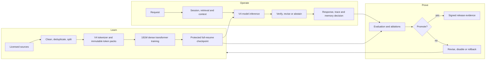

# An-Ra

> An inspectable V4 language-model research system built around one reproducible
> model lineage, durable training, evidence-gated capabilities, and reversible
> growth.

[](pyproject.toml)
[](LICENSE)
[](https://github.com/dhurv0045com-spec/An-Ra-the-new-AGI/tree/iterate500)
[](training/v2_config.py)
[](tokenizer/tokenizer_v4_32k.json)

An-Ra is an independently initialized language-model project. It is not a
wrapper around a hosted pretrained model, and it does not claim that source
files or low training loss prove intelligence.

The project’s central rule is:

> A capability becomes part of An-Ra only when its model, data, checkpoint,
> behavior, cost, evidence, and rollback path agree.

The current goal is concrete: train one useful, interruption-safe
181,132,071-parameter V4 model; post-train it for reliable behavior; then grow
that trained lineage into one function-preserving 499,880,031-parameter child.

## Current reality

| Area | State |
| --- | --- |
| V4 tokenizer and 181M architecture | Implemented and contract-tested |
| Signed training launches | Implemented |
| Exact optimizer/RNG/sampler resume | Implemented and locally tested |
| Concurrent checkpoint durability | Implemented and locally tested |
| Authorized checkpoint-baton cluster | Implemented and contract-tested |
| 181M → 500M growth machinery | Implemented; real-parent parity still required |
| MTP, self-correction, adapters, post-training contracts | Pilot |
| TurboQuant-inspired KV-cache compression | Pilot; real 4-bit storage, not promoted |
| MoE, MoD, transformer HAL, agents, moonshots | Disabled or isolated pilots |
| New coherent V4 language checkpoint | **Not trained yet** |
| Live cross-worker T4 handoff | **Not demonstrated yet** |
| AGI | **Not claimed** |

The next live gate is one 10–15 minute T4 canary, one forced worker handoff,
and independent laptop verification of the protected checkpoint hash. The
campaign proceeds to 200M tokens only after that gate passes.

## The system in one picture



**Learn** creates weights and checkpoints. **Operate** uses the model with
external retrieval, memory, verification, and bounded tools. **Prove** decides
whether a result deserves promotion. These are one connected system, not three
independent products.

## Canonical V4 model

| Property | `anra-v4-180m` |
| --- | ---: |
| Exact parameters | 181,132,071 |
| Vocabulary | 32,768 |
| Context length | 2,048 |
| Layers | 18 |
| Width | 896 |
| Query heads / KV heads | 14 / 2 |
| Head dimension | 64 |
| Feed-forward width | 2,432 |
| Embedding / output head | Tied |
| Optimizer | AdamW |
| Routine seed | 1301 |
| Checkpoint schema | 9 |
| Tokenizer schema | 4 |

The dense transformer uses grouped-query attention, QK normalization, RoPE,
stable residual initialization, and a declared hybrid full/sliding attention
pattern. Optional architecture systems are hard-gated and do not silently
change this baseline.

The only registered larger model is `anra-v4-500m-growth`:

| Property | Growth child |
| --- | ---: |
| Exact parameters | 499,880,031 |
| Layers | 27 |
| Width | 1,280 |
| Query heads / KV heads | 20 / 2 |
| Feed-forward width | 3,456 |

The child cannot start from scratch. It requires a trained 181M parent, signed
tensor mappings, preserved attention modes, identity-initialized inserted
blocks, real logits-parity evidence, and a fresh AdamW optimizer.

## What makes the training foundation different

### One operational tokenizer

V4 is the only tokenizer accepted by a new run. V3 may appear in migration
history but cannot be selected operationally. Model embeddings, corpus packs,
launch manifests, and checkpoints all bind the same V4 artifact and metadata
hash.

### One signed run contract

Every canonical worker receives `anra-training-contract/v4`, binding:

- exact source commit and clean checkout;
- model profile and parameter contract;
- tokenizer and data-manifest hashes;
- AdamW recipe and seed 1301;
- unique token-window boundaries;
- immutable parent checkpoint;
- artifact destinations and resource limits;
- worker, role, and owner authorization.

The worker rejects modified manifests, wrong commits, duplicate token windows,
stale checkpoint parents, and source/destination collisions.

### Exact resumability

A schema-9 `full_resume` artifact preserves:

- model, optimizer, scheduler, and scaler;
- CPU and CUDA random states;
- completed optimizer boundary;
- sampler cursor and accumulation state;
- global step and accepted token count;
- architecture, tokenizer, data, recipe, seed, and commit lineage.

`fp16_inference` is a smaller model-only artifact. It is structurally rejected
for training resume.

### Checkpoint durability during training

The trainer saves every 200 optimizer steps or 60 minutes, whichever comes
first. Checkpoints are divided into immutable 128 MiB content-addressed chunks
and uploaded concurrently. Interrupted transfers resume from verified offsets.

The state advances only through:

```text
local_saved → staged → canonical_verified → protected
```

The previous resumable generation survives until its replacement is protected.
A filename in Drive is not enough; the manifest, chunk hashes, receipts, and
typed canonical pointer establish truth.

## The GPU cluster

An-Ra owns model and checkpoint truth. The separate
[GPU Cluster](https://github.com/dhurv0045com-spec/gpu-cluster-gmail) repository
owns worker authentication, leases, scheduling, handoff, artifact transfer,
operator controls, and audit.

Recommended authorized Colab roles:

| Worker | Responsibility |
| --- | --- |
| `canonical_trainer` | The only worker allowed to advance canonical weights |
| `standby` | Preloads and safely takes over after a lease handoff |
| `data_builder` | Prepares and verifies the next deterministic pack |
| `evaluator` | Evaluates immutable checkpoints |
| `architecture_pilot` | Runs one bounded comparison |
| `archive_worker` | Mirrors and verifies artifacts |

Separate Colab machines do not synchronize gradients. They perform different
authorized jobs or pass the protected checkpoint baton. True DDP/FSDP is
reserved for multiple GPUs on one low-latency host after runtime support is
implemented and proven.

Use only accounts and sessions for which the provider has granted compute.
Login, account selection, Colab authorization, and the initial **Run all** are
manual owner actions.

Read the [plain-language cluster training guide](docs/CLUSTER_TRAINING_GUIDE.md)
before starting a paid or limited session.

For the prepared single-T4 continuation, use
[the protected Colab trainer](notebooks/AN_RA_T4_PROTECTED_TRAINER_V4.ipynb) with
the [short operator guide](docs/COLAB_T4_PROTECTED_TRAINING.md).

## Intelligence systems: active, pilot, or off

| System | Current lifecycle | Why it exists |
| --- | --- | --- |
| Dense V4 | Active | Stable language foundation |
| Exact resume and durability | Active | Reproducible interruption recovery |
| Retrieval and memory | Active runtime | Updateable, attributable knowledge |
| ThirdEye and Matrix evidence | Active | One shared evidence stream, two views |
| MTP | Pilot | Test richer future-token prediction |
| External HAL | Pilot | Inspectable bounded runtime policy |
| Self-correction | Pilot | Verify, revise, or abstain under a budget |
| LoRA/DoRA adapters | Pilot | Reversible skill acquisition |
| TurboQuant KV cache | Pilot | Reduce persistent inference memory with measured distortion |
| SFT/RLVR/STaR/DPO | Pilot contracts | Post-training with explicit lineage |
| MoD, RIM, ESV, DSTP | Disabled baseline | Require individual matched evidence |
| Current MoE | Disabled | Present geometry is too large for the T4 baseline |
| Agents and tools | Disabled | Await useful model and permission evidence |
| Moonshots | Isolated pilots | Research without entering the critical path |
| Multimodal/world/robotics | Disabled research | Later capability stages |

TurboQuant is an inference-efficiency pilot, not an intelligence claim. The
implemented path applies a deterministic randomized Hadamard rotation, scalar
quantization, true 4-bit nibble packing, FP16 norms, and physical-byte
telemetry inside the model's real attention cache. It currently dequantizes
before PyTorch SDPA, so it may save persistent KV memory without improving
latency. It remains opt-in until a trained V4 checkpoint passes the dedicated
quality, distortion, peak-VRAM, and throughput gate.

To activate it for one running API process, first ask the runtime to select the
lowest precision that preserves the checkpoint's bounded generation probe:

```powershell
Invoke-RestMethod -Method Post `
  -Uri http://127.0.0.1:8000/diagnostics/cache-parity `
  -ContentType application/json `
  -Body '{"backend":"turboquant","turboquant_bits":"auto","max_tokens":8}'
```

Use the returned `selected_bits` in generation requests. Authorization is
precision-specific and process-local: passing 8-bit never enables 4-bit, and a
server restart requires a new check. On the local 181M rehearsal checkpoint,
4-bit changed the greedy output and was rejected; automatic selection chose
8-bit, which preserved the bounded output while reducing cache capacity by
3.88x. That proves the serving mechanism—not language quality, because the
rehearsal checkpoint has only three optimizer steps.

The executable lifecycle registry is
[`runtime/subsystem_catalog.py`](runtime/subsystem_catalog.py). File presence
does not imply runtime health or promotion.

## Quick start

Python 3.10+ is required. CPU is sufficient for documentation, contracts, and
most structural tests. Canonical training requires CUDA.

```powershell
git clone --branch iterate500 --single-branch `
  https://github.com/dhurv0045com-spec/An-Ra-the-new-AGI.git
Set-Location An-Ra-the-new-AGI

python -m venv .venv
.\.venv\Scripts\python.exe -m pip install --upgrade pip
.\.venv\Scripts\python.exe -m pip install -e ".[dev]"
```

Check the runtime:

```powershell
.\.venv\Scripts\python.exe -c "import torch; print(torch.__version__, torch.cuda.is_available())"
.\.venv\Scripts\python.exe -m training.train_unified --mode preflight
```

Preflight is deliberately fail-closed: it exits nonzero and prints actionable
blockers when the machine, data authorization, or artifact state is not valid
for canonical training. A local RTX 4050 can still run bounded engineering
pilots, but the canonical 2,048-token profile requires at least 14 GiB VRAM.

Start the local Developer UI:

```powershell
.\scripts\start_local_chat.ps1
```

Open `http://127.0.0.1:8000/developer`.

The launcher selects the canonical V4 checkpoint when present, otherwise the
latest compatible local rehearsal checkpoint. It verifies the CUDA
environment, starts the server in the background, waits for model readiness,
and opens the interface. Stop it with:

```powershell
.\scripts\stop_local_chat.ps1
```

Useful read-only endpoints:

```text
GET /health
GET /system-map
GET /phase-health
GET /training/preflight
GET /evidence/status
```

Chat and generation require a checkpoint compatible with the active V4
profile:

```text
POST /chat
POST /generate
GET  /traces/{trace_id}
```

## Preparing a real training campaign

Do not begin by launching hours of training. Follow this order:

1. Freeze and push the exact An-Ra and cluster commits.
2. Verify immutable V4 tokenizer and data-pack hashes.
3. Configure owner-held signing keys and the Drive hot vault.
4. Generate a signed launch manifest.
5. Run a 10–15 minute authorized T4 canary.
6. Confirm the first `full_resume` is remotely verified.
7. Force one worker handoff and verify continuity locally.
8. Continue the same lineage through 200M, 500M, 1B, and approximately 3.6B
   cumulative tokens.
9. Run behavioral evaluation at milestones, not after every ordinary edit.

Create a signed launch from a clean checkout:

```powershell
$env:ANRA_MANIFEST_SIGNING_KEY = "<owner-held secret>"

.\.venv\Scripts\python.exe scripts\create_cloud_launch.py `
  --pack-root "C:\path\to\pack" `
  --output "output\v2\cluster_launch.json" `
  --artifact-path "output/v2/checkpoints/anra-v4-180m.pt" `
  --checkpoint-source scratch `
  --worker-id trainer-1 `
  --runtime-estimate-hours 3 `
  --model-profile anra-v4-180m `
  --stage canary
```

The signed JSON is immutable. Bind it to a reviewed cluster job; do not edit it
after signing.

## Evaluation philosophy

Low loss alone does not establish language quality. Milestone evaluation
examines:

- validation loss stratified by source;
- coherent and diverse generation;
- repetition, EOS, and output-distribution collapse;
- copying and memorization;
- uncertainty and abstention;
- short reasoning, mathematics, code, and context use;
- retrieval grounding and session isolation;
- activation, residual, gradient, and routing health;
- exact checkpoint continuity and rollback.

Architecture comparisons start from the same parent checkpoint and use the
same seed, optimizer, data order, and token budget. A second or third seed is
used only when the measured result is too close to decide—not for routine
training and not as three permanent models.

## Focused verification

Run tests that answer the current engineering question:

```powershell
.\.venv\Scripts\python.exe -m pytest -q `
  tests/test_training_contract_v4.py `
  tests/test_checkpoint_durability.py `
  tests/test_cloud_launch_contract.py `
  tests/test_model_growth_contract.py

.\.venv\Scripts\python.exe -m ruff check `
  training/launch_manifest.py `
  training/checkpoint_durability.py `
  training/train_unified.py
```

Broad CPU, GPU, Drive, corpus, and checkpoint suites belong at their relevant
milestones. A smoke test proves execution; it does not prove intelligence.

## Repository map

```text
anra/          model package, architecture contracts, serving adapters
training/      data, optimizer, trainer, checkpoints, growth, post-training
inference/     context, generation, cache, reasoning budgets, adapters
retrieval/     provenance-grounded external knowledge
memory/        session and long-term memory routing
cognition/     planning, debate, verification, self-correction
agents/        bounded orchestration and specialist routing
execution/     sandbox and tool-execution boundaries
evaluation/    behavioral evidence, promotion, rollback
engine/        reports and telemetry
runtime/       component registry, subsystem lifecycle, shared evidence
scripts/       supported operational entrypoints
notebooks/     Colab workflows
tests/         contract, unit, integration, and evidence gates
docs/          architecture, guides, forensics, plans, and history
```

## Documentation

### Understand the whole system

- [Architecture](docs/ARCHITECTURE.md) — Learn, Operate, and Prove connected.
- [Walkthrough](docs/WALKTHROUGH.md) — the story from licensed text to a
  trusted response.
- [V4 Architecture Gate](docs/engineering/V4_ARCHITECTURE_GATE.md) — frozen
  model geometry and subsystem boundaries.

### Build and train

- [Developer Guide](docs/DEVELOPER.md) — setup, runtime, extension, and tests.
- [Cluster Training Guide](docs/CLUSTER_TRAINING_GUIDE.md) — authorized
  multi-Colab workflow in simple language.
- [Training and Recovery Blueprint](docs/engineering/MODEL_RECOVERY_AND_TRAINING_BLUEPRINT.md)
  — staged campaign, handoff, recovery, and growth.

### Inspect and improve

- [Checkpoint Forensics](docs/engineering/CHECKPOINT_FORENSICS.md) — artifact
  identity, pathology, and resume analysis.
- [Improvement Framework](docs/IMPROVEMENT.md) — how subsystems earn promotion.
- [Engineering Log](docs/engineering/ENGINEERING_LOG.md) — historical
  implementation evidence.
- [Progress](PROGRESS.md) and [TODO](TODO.md) — present state and next work.

## Truth and provenance

When descriptions disagree, trust sources in this order:

1. The signed launch and checkpoint manifests for the actual run.
2. Executable contracts in `training/v2_config.py`,
   `training/launch_manifest.py`, and `runtime/subsystem_catalog.py`.
3. Generated [`docs/system_graph.json`](docs/system_graph.json).
4. Current explanatory documentation.
5. Historical engineering discussion.

Regenerate the system graph after architecture truth changes:

```powershell
.\.venv\Scripts\python.exe -c "from runtime.system_registry import write_system_manifest; write_system_manifest()"
```

An-Ra’s purpose is not to hide uncertainty behind an ambitious label. Its
purpose is to preserve the experiment, make the machinery inspectable, learn
from controlled evidence, and retain the ability to recover or roll back when
an idea fails.

## License

MIT. See [LICENSE](LICENSE). Dataset sources retain their own licenses and must
pass the repository’s provenance and license gates before entering a training
pack.
