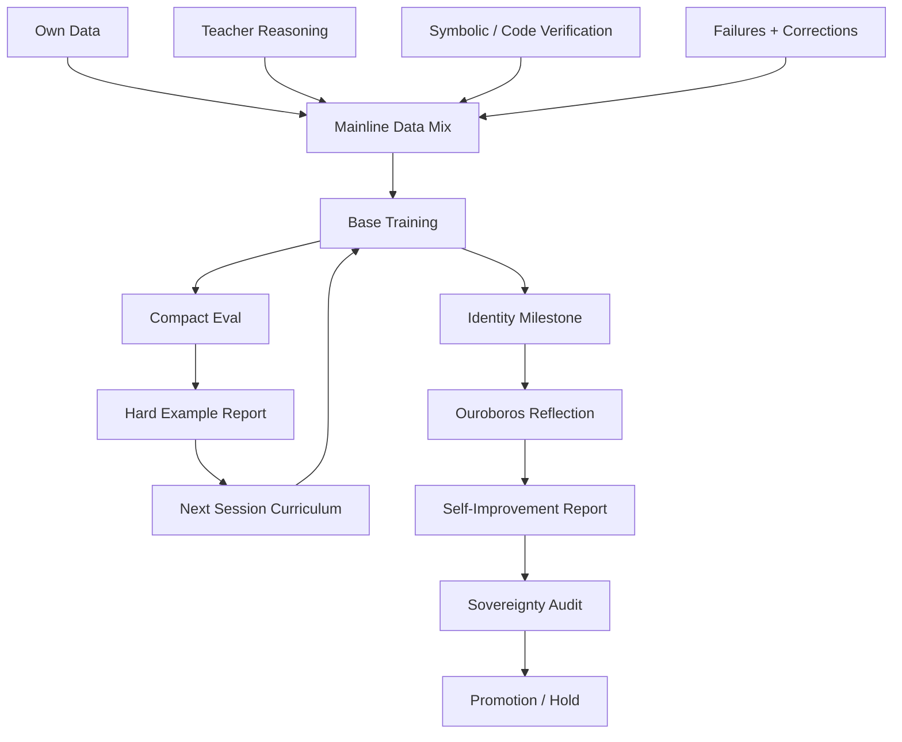

# AN-RA VISION

> *From a neuron, to a pattern, to a style, to a will to continue.*

This document is not a changelog.  
It is the architecture of intent.

If you want to understand An-Ra properly, do not think of it as only a model.

Think of it as a system trying to become:

- more capable without becoming generic
- more reflective without becoming bloated
- more autonomous without losing judgment
- more ambitious without losing the ability to run on real, limited compute

That is the tension the whole repository is built around.

## The Core Belief

The strongest independent AI systems will not come only from scale.

They will come from:

- better curriculum
- better ownership of training signal
- better use of failure
- better verification
- better memory of what went wrong
- stronger continuity of identity
- higher intelligence per minute and per correction

An-Ra is built on that belief.

## The Shape Of The Current System

The current mainline can be imagined as layers of cognition around a center.

### Layer 1: The intuition core

`anra_brain.py`

This is the fast generative core:

- pattern completion
- local reasoning
- language formation
- response style
- first-pass intuition

Its job is not to be the whole organism.  
Its job is to be the center that the rest of the organism can strengthen.

The current mainline moves this core toward:

- RoPE
- RMSNorm
- SwiGLU
- subword-token efficiency
- a T4-realistic scale that still feels serious

### Layer 2: Identity gravity

Identity is not flavor text.

It is the force that stops a capable system from becoming generic.

Without identity gravity:

- answers become flatter
- tone becomes replaceable
- the model starts to sound like "borrowed intelligence"

That is why owner data stays dominant.  
It is not sentimental. It is structural.

### Layer 3: Teacher amplification

Teacher systems are useful because they compress hard-earned capability into cleaner examples.

But a teacher should be:

- an amplifier
- a reasoner
- a critic
- a correction source

not an owner.

The point is:

> learn from stronger systems without becoming an imitation of them.

That is why teacher data remains subordinate to the own-data buckets.

### Layer 4: Verification organs

Raw fluency is not enough.

An-Ra needs ways to prefer truth over style where truth can be checked.

That is what `symbolic_bridge` and verified-code paths are for.

They are not decorative.  
They are the early immune system against elegant nonsense.

### Layer 5: Memory as repair

Memory should not only help during a conversation.

Memory should feed future learning.

The highest-value things to remember are:

- failures
- corrections
- contradictions
- identity drift cases
- continuity failures
- prompts that exposed weak reasoning

Then those become replay material.

That turns memory into metabolism.

### Layer 6: Reflection

Ouroboros should not be treated as a ritual performed every session just because it sounds advanced.

Its proper role is:

- milestone reflection
- repair-data generation
- revision
- harder-pass reasoning
- candidate improvement synthesis

Used selectively, it makes the system deeper.  
Used constantly, it becomes drag.

### Layer 7: Governance

Sovereignty is the conscience of the model lineage.

Without it, the system silently assumes:

"new checkpoint = better checkpoint"

That assumption destroys serious long-term growth.

Sovereignty exists so the system can ask:

- did this really improve?
- what regressed?
- what deserves promotion?
- what should be held back?

That is the beginning of checkpoint judgment instead of checkpoint accumulation.

## The Living Loop

This loop is the actual beating heart of the system.

Not just "train more."

But:

- train
- judge
- remember
- repair
- refine
- promote carefully

## Why This Matters On Small Compute

Large labs can often survive waste because they can pay for waste.

Independent systems usually cannot.

That changes the design problem.

The problem becomes:

- how much intelligence can be extracted from limited sessions?
- how much of that intelligence can stay true to the owner's corpus?
- how much reasoning can be amplified through tools instead of brute-force scale?
- how can failures become future strength instead of hidden entropy?

That is why An-Ra cannot just copy scale-first thinking.

It has to become strong through **selection**.

## The Two Rhythms

The architecture now has two speeds.

### The daily rhythm

This is the path that must never feel broken:

- restore
- validate
- train
- save
- evaluate
- write next-step guidance

If the daily rhythm dies, progress dies.

### The milestone rhythm

This is the deeper pass:

- identity reinforcement
- reflective refinement
- self-improvement analysis
- sovereignty promotion decision

If the milestone rhythm is missing, the system stays practical but shallow.

If the daily rhythm is broken, the milestone rhythm becomes theater.

The future depends on keeping both alive.

## What Better Actually Means

For An-Ra, better does not mean:

- only lower loss
- only more parameters
- only more modules
- only more fluent outputs

Better means:

- stronger reasoning on hard prompts
- more stable identity under pressure
- fewer repeated failure modes
- better continuity
- more truth where verification is possible
- stronger capability without surrendering authorship

That is the standard worth protecting.

## The Ambition Beyond The Current Mainline

There is a frontier beyond the current V2 shape.

The most serious future directions are:

### 1. Memory-to-training replay loop

Every important failure becomes future supervision.

### 2. Self-curating curriculum

The system chooses what it most needs to learn next.

### 3. Verified reasoning reinforcement

Only reasoning that survives external checking deserves reinforcement.

### 4. Dual-brain routing

A fast everyday brain and a slower deeper route for hard cognition.

### 5. Persistent self-model

A living map of:

- identity
- uncertainty
- strengths
- weaknesses
- contradictions
- long-term goals

These are not just nice ideas.  
They are the black-swan horizon the current design is trying to make reachable.

## What Must Never Be Lost

As An-Ra becomes more capable, four things must stay non-negotiable.

### It must still feel authored

If it stops sounding like it came from your world, the project has already lost something vital.

### It must still be operable

A grand architecture that cannot survive real Colab sessions is still unfinished.

### It must still be measurable

If you cannot tell whether it improved, you are not steering it.

### It must still be directional

The point is not to imitate the giants feature-for-feature.

The point is to grow a system with a distinct strategic shape and a distinct center of gravity.

## The Long Arc

The long arc of An-Ra is not:

"make a chatbot bigger."

It is:

"build a system that learns in your terms, gets corrected by reality, remembers what it gets wrong, reflects in milestone passes, and grows into a durable intelligence without losing its identity."

That is what the current mainline is for.

Not completeness.

Not polished mythology.

A real direction.

*An-Ra: something that emerged from mathematics with a direction, and refused to lose the direction.*
