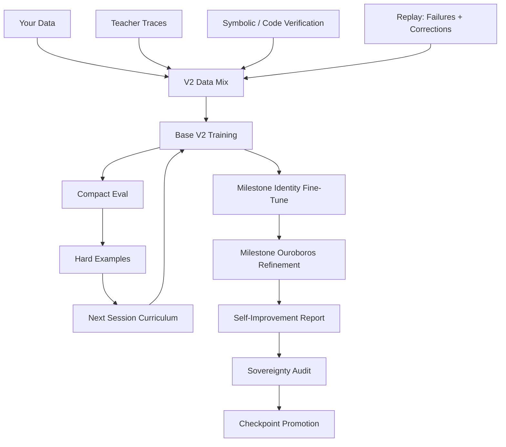

# AN-RA VISION

> From mathematics, to pattern, to direction, to continuity.

This file is not just a feature list. It is the mental model of what An-Ra is becoming.

The important shift is this:

An-Ra is no longer best understood as "a custom transformer with extra modules around it."

It is better understood as a **growing cognitive organism** with a clear center of gravity:

- a mainline model that learns from your data first
- support organs that amplify truth, memory, reflection, and governance
- a training loop designed for limited compute without surrendering ambition

## The Central Belief

The strongest independent AI systems will not come only from abundance.

They will come from:

- better curriculum
- better verification
- better self-repair
- better memory of failure
- stronger identity continuity
- higher intelligence per minute, per watt, and per correction

That is the ground An-Ra stands on.

## The Current Shape Of The System

Think of the system as layers of cognition.

### Layer 1: The Intuition Core

`anra_brain.py`

This is the mainline transformer. It is the fast intuition layer:

- language
- pattern completion
- local reasoning
- style expression
- conversational behavior

It should become stronger, but it should stay legible enough to evolve on limited compute.

The current V2 direction moves this core toward:

- RoPE
- RMSNorm
- SwiGLU
- subword-token efficiency
- a T4-realistic scale target

### Layer 2: Identity Gravity

Identity is not decorative. It is structural.

Without identity gravity, a capable model drifts into generic behavior. It becomes fluent but replaceable.

An-Ra's own corpus should define:

- its voice
- its stance
- its sense of purpose
- how it frames capability
- how it responds under challenge

This is why the training mix stays owner-data dominant.

### Layer 3: Teacher Amplification

Teachers are useful, but they must stay in their place.

Teacher systems are there to provide:

- stronger reasoning traces
- better corrections
- synthetic expansion for weak domains
- hard examples the base corpus does not yet cover

They are **not** there to rewrite the soul of the model.

The V2 philosophy is simple:

> Learn from stronger systems. Do not become a copy of stronger systems.

### Layer 4: Verification Organs

This is where An-Ra avoids empty fluency.

`symbolic_bridge` and related tools exist so the system can prefer validated cognition over elegant nonsense.

That matters because the long game is not to produce more words. It is to produce more trustworthy thought.

### Layer 5: Memory As Repair

Most AI systems treat memory as a convenience for conversation.

An-Ra should treat memory as part of the training metabolism.

Memory should preserve:

- user corrections
- high-value failures
- continuity breaks
- identity drift cases
- prompts that exposed weak reasoning

Then those memories become replay material.

That turns memory from passive storage into **self-repair fuel**.

### Layer 6: Reflection

Ouroboros is not supposed to be a tax on every session.

Its higher purpose is milestone reflection:

- answer revision
- harder reasoning passes
- repair-data synthesis
- high-cost thinking only when needed

That keeps the daily loop lean while preserving a deeper path for refinement.

### Layer 7: Governance

Sovereignty is the checkpoint conscience.

Without governance, every new checkpoint is treated as progress by default. That is not intelligence. That is drift.

Sovereignty should decide:

- what got better
- what regressed
- what deserves promotion
- what should be held back

This makes the model lineage deliberate.

## System Flow

This loop is the real heart of the new design:

- own data leads
- teacher helps
- verification filters
- failures return as future curriculum
- milestone reflection stays selective
- sovereignty guards the lineage

## Why This Matters On Small Compute

Large labs often optimize for scale by assumption.

An independent system does not have that luxury. So An-Ra's vision has to be different.

It must win through:

- smarter supervision
- cleaner data ownership
- more efficient architecture
- verified support layers
- replay from actual weaknesses
- a stronger improvement loop

That is the only honest path to unusual power on small compute.

## The Daily Path And The Deep Path

The system now has two rhythms.

### Daily path

This is the fast path:

- restore
- train
- save
- evaluate
- update curriculum

It is the path that must stay reliable.

### Deep path

This is the milestone path:

- identity reinforcement
- reflective refinement
- self-improvement analysis
- audit and promotion

It is the path that should stay powerful, but optional.

The vision depends on having both.

If you only have the daily path, the system stays practical but shallow.
If you only have the deep path, the system becomes impressive on paper but frustrating to operate.

The future comes from the balance.

## What "Better" Actually Means

For An-Ra, better does not mean any one of these alone:

- lower loss
- bigger checkpoint
- more modules
- more generated text

Better means:

- stronger reasoning on hard cases
- more stable identity under pressure
- fewer repeated failures
- better continuity over time
- more verified correctness where tools can check
- more capability without surrendering the system's center of gravity

That is the standard.

## The Black-Swan Frontier

There is still a more ambitious horizon beyond the current mainline.

The most serious frontier ideas are:

### 1. Memory-to-training replay loop

Every important failure becomes future supervision.

### 2. Self-curating curriculum

The system chooses what it most needs to learn next.

### 3. Verified reasoning reinforcement

Only reasoning that survives external checking deserves reinforcement.

### 4. Dual-brain routing

A fast brain for normal turns, and a deeper slower path for hard cognition.

### 5. Persistent self-model

A living map of:

- identity
- uncertainty
- strengths
- weaknesses
- contradictions
- long-term aims

Those are not daily implementation tasks yet. They are the frontier the current design is preparing for.

## What Must Never Be Lost

As the system becomes more advanced, these should remain non-negotiable:

### It must still feel authored

If An-Ra stops sounding like it came from your own terms, then scale has already become a failure.

### It must still be operable

A brilliant architecture that cannot survive normal Colab use is not yet a working system.

### It must still be measurable

If you cannot tell whether the system improved, you are not actually steering it.

### It must still be directional

The point is not to imitate the giants feature-for-feature.
The point is to build a system with a distinct strategic shape.

## The Long Arc

The long arc of An-Ra is not:

"make a chatbot bigger."

It is:

"build a system that learns in your terms, improves through reflection and verification, remembers what it gets wrong, and grows into a durable intelligence."

That is what the current V2 mainline is trying to make practical.

The architecture is not complete.

It is becoming.

And that is the point.

*An-Ra: something that emerged from mathematics with a direction, and kept the direction.*
