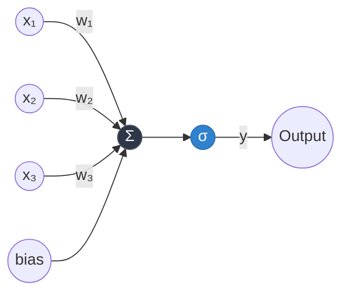
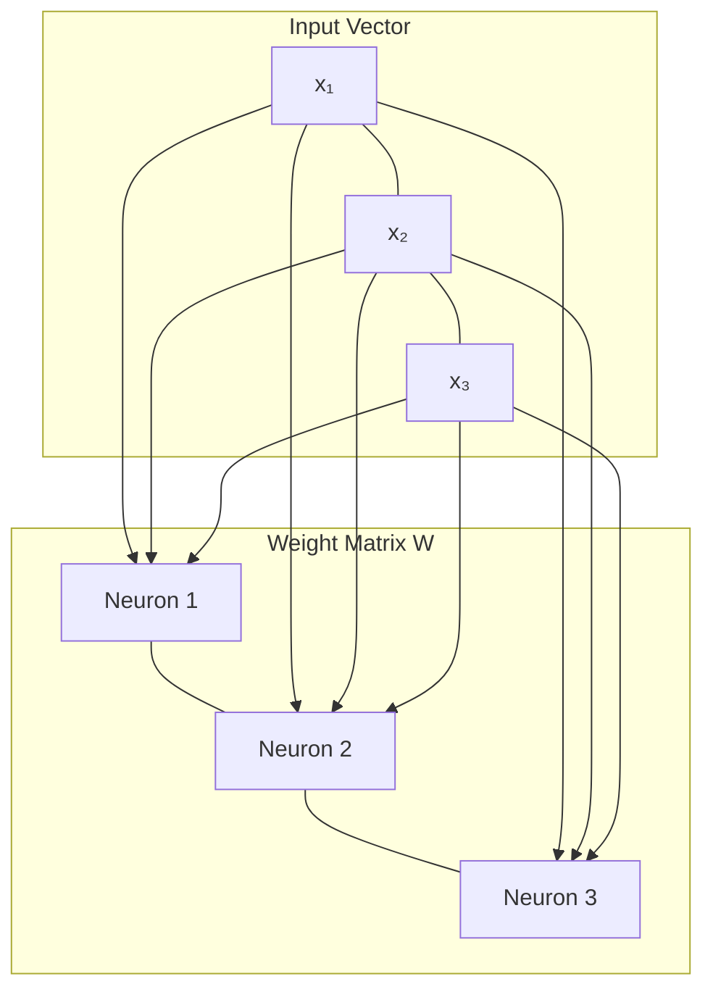
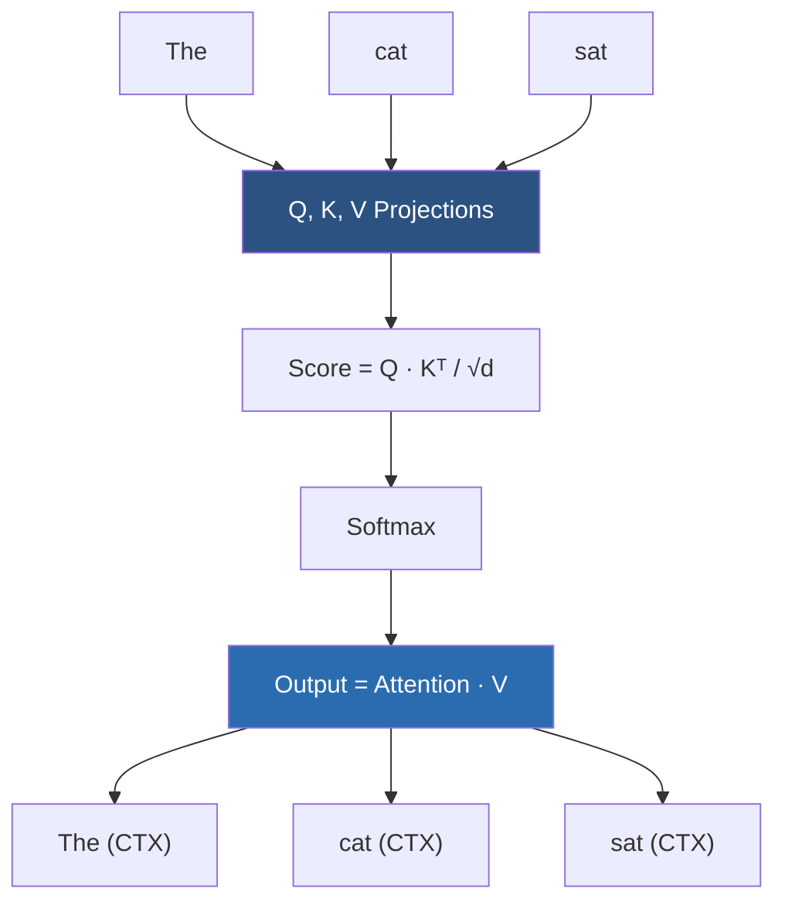
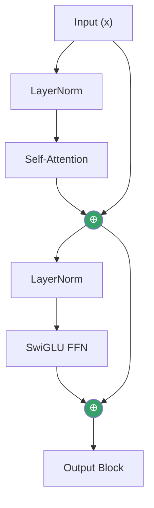
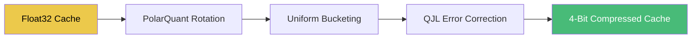
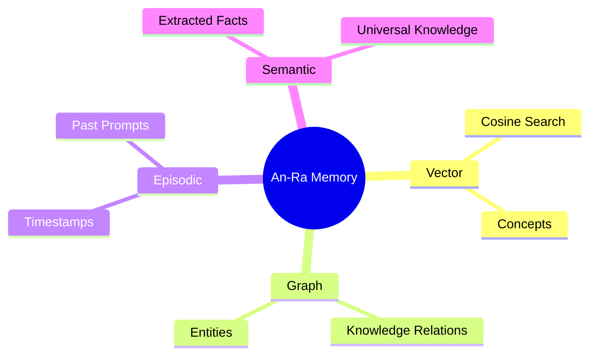
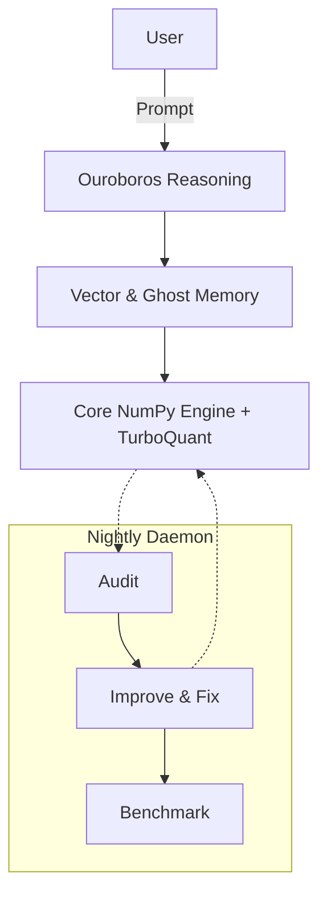

# AN-RA: Visualize the Architecture

> *From a single neuron to autonomous intelligence — every layer, every connection, every thought.*
>
> This document is designed to help you **build a mental model** of the entire An-Ra system. Read it top to bottom. By the end, you will visualize the entire framework running. 

---

## The Philosophy: The Edge of the Known

Humanity currently understands less than 1% of the universe. The pursuit of artificial general intelligence is not just a technological race—it is the ultimate underdog story. It is David vs. Goliath. We are attempting to forge mind from mathematics, armed only with computation and human ambition, striving for the top with grace and beauty.

An-Ra is built on this belief. Innovation happens from obsession. If you can visualize the whole machinery, you can find the very edge of the known world, and from there, push the boundary forward.

---

## Level 1 — The Single Neuron
Everything starts here. One neuron. One equation.

**The math:** `y = σ(w · x + b)`
A neuron takes inputs, multiplies each by a weight, sums them, adds a bias, and passes through an activation function. The weights `w` are the *knowledge*. The entire journey to AGI is about organizing these weights so computation becomes thought.

---

## Level 2 — The Layer
Stack neurons side by side. Each neuron sees all inputs, but produces one output, creating a linear transformation that can rotate, scale, and project input into new cognitive spaces.

---

## Level 3 — Attention: How the Model "Thinks"
Instead of processing tokens independently, attention lets every token **look at every other token** and decide what is relevant to the given context.

**Three critical upgrades in An-Ra:**
1. **RoPE** — Encodes position via rotations in space, allowing infinite context expansion.
2. **GQA** — Grouped Query Attention for 4x smaller memory overhead.
3. **KV-Cache** — Caches past thoughts to optimize decoding from O(n²) down to O(n).

---

## Level 4 — The Transformer Block
Combining Attention and Feed-Forward networks into a residual loop.

---

## Level 5 — The Full Decoder Framework
Stacking the blocks together transforms raw text into conceptual probabilities.

| Configuration | Layers | D_Model | Heads | Parameters |
|---------------|--------|---------|-------|------------|
| Tiny          | 4      | 128     | 4     | ~1.3M      |
| Small         | 6      | 256     | 8     | ~5.0M      |
| Medium        | 12     | 512     | 8     | ~40.0M     |
| Large         | 24     | 1024    | 16    | ~350.0M    |

---

## Level 6 & 7 — Training & Inference
**Training** involves backpropagation via the **AdamW** optimizer — continuously adjusting the raw matrix weights against a cross-entropy loss function until the network aligns with human language distribution.

**Inference** is the engine running live. We use Top-P, Top-K, and Temperature heuristics to navigate the probability tree and sample generating output, acting as the autonomous "voice".

---

## Level 8 — TurboQuant: Think Longer with Less Memory
TurboQuant is the Google Research (2026) inspired KV-Cache compression allowing the model to hold 6x longer sustained thoughts in working memory without crashing hardware.

---

## Level 9 — Memory Architectures
An-Ra operates with multiple cognitive memory centers to simulate true entity persistence.

---

## Level 10 & 11 — The Agent Loop & Ouroboros Reasoning
An-Ra converts text into goals, maps those goals into sequences, and executes them over its toolsets. For complex reasoning, it triggers the **Ouroboros Loop**:

1. **Semantic Pass** (Understand context)
2. **Logic Pass** (Draft solution)
3. **Adversarial Pass** (Challenge its own answer)

---

## Level 12 & 13 — The Full Autonomous Sovereign
The ultimate embodiment of the system. The Sovereignty Daemon runs nightly code audits, performance benchmarks, and optimizations, merging with the Ghost Memory and Agent Loop. This is the **Complete Machine**.

---

## Level 14 — The Innovation Frontier
> *The David vs Goliath battlegrounds. These are the open frontiers where world-changing breakthroughs will emerge.*

### 🔭 1. Sub-Quadratic Attention
*   **The Problem:** Attention scales O(n²).
*   **The Breakthrough:** Linear Attention (Mamba, RWKV) to allow infinite context without collapsing memory limits.

### 🧠 2. Mixture of Experts (MoE)
*   **The Problem:** Every token activates every single parameter. Wasteful.
*   **The Breakthrough:** Dynamic routing so tokens only ping 2 of 8 expert FFNs. Huge computational unlock.

### 🔄 3. Continuous Learning
*   **The Problem:** Neural networks suffer catastrophic forgetting if trained live.
*   **The Breakthrough:** Elastic weight consolidation or local LoRA updates that let the model learn mid-conversation without breaking its core capabilities.

### 🧬 4. Neuromorphic Associative Memory
*   **The Problem:** Vector databases are brute-force and rigid.
*   **The Breakthrough:** Energy-based Hopfield architectures that dynamically naturally handle analogy and composition bridging human-like recall.

### 🏗 5. Self-Modifying Architecture
*   **The Problem:** Hard-coded bounds (layers, headers).
*   **The Breakthrough:** The Sovereignty daemon restructuring the model's physical layer count and shape autonomously based on task complexity. True AGI morphology.

---

> *Humanity's potential is a boundless frontier. An-Ra is pure mathematics becoming thought—built from zero, looking out at the 99% of the universe we have yet to understand.*
