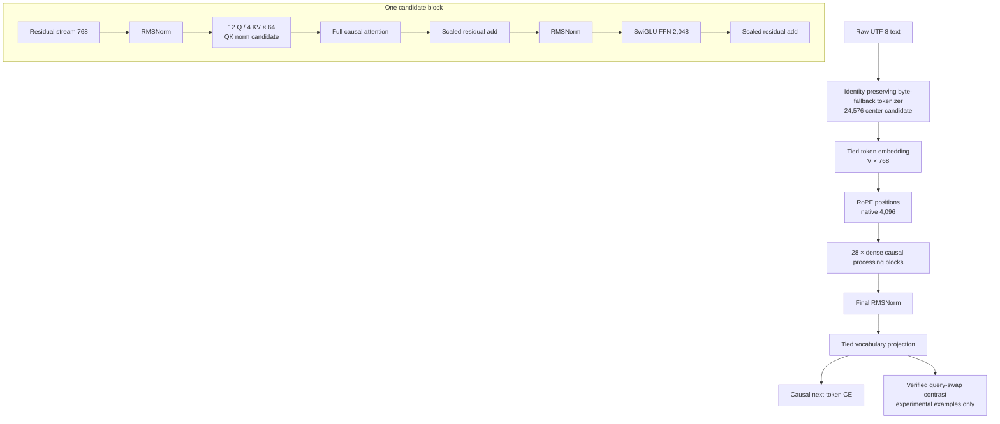

# Ground Blueprint v0.1 — Model Architecture

This is an engineering specification, not implementation. Bracketed states are governed by `docs/esoes/DECISIONS.md`.

## Cognitive information flow



The architecture contains no explicit task labels, symbolic slots, state registers, memory modules, routers, or cognition heads. Learned attention/MLP circuits must earn query-conditioned binding and transformation under controlled training.

## Candidate V5-A configuration

| Field | Value | State |
|---|---:|---|
| family | dense decoder-only Transformer | [FROZEN] baseline |
| vocabulary | 24,576 | [EXPERIMENT REQUIRED: E1] |
| width | 768 | [EXPERIMENT REQUIRED: E2] |
| layers | 28 | [EXPERIMENT REQUIRED: E2] |
| query heads | 12 | [PROVISIONAL] |
| KV heads | 4 | [EXPERIMENT REQUIRED: E2] |
| head dimension | 64 | [PROVISIONAL] |
| FFN | 2,048 SwiGLU | [EXPERIMENT REQUIRED: E2] |
| attention | full causal, every layer | [EXPERIMENT REQUIRED: E2] |
| context | 4,096 native | [EXPERIMENT REQUIRED: E2] |
| position | RoPE, base 10,000; no extrapolation claim | [PROVISIONAL] |
| norm | pre-RMSNorm, epsilon 1e-5 | [PROVISIONAL] |
| QK norm | on candidate | [EXPERIMENT REQUIRED: E2] |
| embeddings/head | tied | [PROVISIONAL] |
| linear bias | none | [PROVISIONAL] |
| dropout | zero | [PROVISIONAL] |
| initialization | normal 0.02; residual outputs scaled near `1/sqrt(2L)` | [PROVISIONAL] |
| compute precision | BF16 with FP32 reductions/optimizer | [PROVISIONAL] |

## Parameter receipt

Assuming bias-free projections, GQA keys/values of width 256, two per-block RMSNorm vectors, tied embeddings, and one final RMSNorm:

```text
embedding        24,576 × 768                           = 18,874,368
Q projection     768 × 768                              =    589,824
K + V            2 × 768 × 256                          =    393,216
O projection     768 × 768                              =    589,824
SwiGLU           3 × 768 × 2,048                        =  4,718,592
block norms      2 × 768                                =      1,536
per block                                                =  6,292,992
28 blocks        28 × 6,292,992                         =176,203,776
final norm                                               =        768
total                                                    =195,078,912
```

The future executable constructor must independently reproduce this count. If E1/E2 changes vocabulary or shape, this receipt becomes historical and `DECISIONS.md` must be reopened.

## Scale family

| Model | Center shape | Approx. parameters | Scientific authority |
|---|---|---:|---|
| Micro | 12×256, FFN 704 | 15–20M | pipeline/generator canary only |
| P35 | 16×384, FFN 1024 | 34.6M | rank experimental choices |
| M102 | 20×640, FFN 1728 | 101.8M | replicate recipe/scale transfer |
| V5-A | 28×768, FFN 2048 | 195.08M | first serious run after freeze |
| Later | unselected | open | only measured capacity/data evidence |

P35 results cannot prove an emergent capability. M102 must reproduce the winning direction before V5-A.

## Rejected from V5-A baseline

- Mamba/SSM, Griffin/recurrent blocks, Titans/test-time memory;
- MoE or learned routing;
- explicit key/value or differentiable long-term memory;
- multi-token prediction, latent-thought heads, or separate realization head;
- untied output head without an ablation;
- local/sliding attention inherited from V4;
- learned task, family, difficulty, answer-index, or latent-graph tokens.

These are deferred, not declared impossible. They reopen only when a measured bottleneck gives the experiment decision value.

## Cognitive measurements mapped to model outputs

| Operation | Observable |
|---|---|
| represent | gold/distractor candidate NLL, rank, layerwise probe used diagnostically |
| address | likelihood change under fact-fixed query swaps |
| transform | state-swap and matched multi-hop versus retrieval-control accuracy |
| choose | raw candidate argmax, margin, query-flip direction |
| realize | free exact/semantic output, conditional on known correct selection |

Probes do not become training labels by default. A linear probe detecting information does not prove the model uses it.
