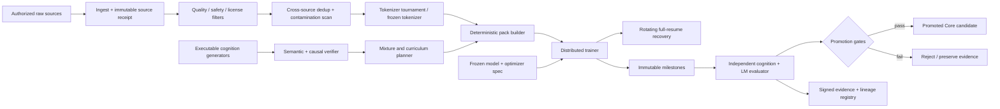

# Ground Blueprint v0.3 — Software and Training System

This specifies the clean implementation boundary and deliberately does not copy the VNext directory layout or checkpoint schema. [`IMPLEMENTATION_BLUEPRINT.md`](IMPLEMENTATION_BLUEPRINT.md) is authoritative for exact packages, interfaces, commands, artifacts, CI gates, and milestone acceptance.

## End-to-end system



## Repository topology

The framework-independent `v5_contracts/`, executable `e0_cognition/`, and `e1_tokenizer/` research harness now exist. Production packages below remain gate-controlled.

```text
esoes/
  v5_contracts/
    model_spec.py             exact frozen configuration schema
    data_spec.py              sources, mixture, split, tokenizer identities
    evidence.py               immutable receipt and result schemas
  v5_data/
    ingest/                   source adapters; raw content stays outside Git
    filtering/                deterministic quality/license/safety stages
    dedup/                    exact + near-duplicate and contamination checks
    generators/               executable causal cognition families
    curriculum/               static mixture and staged/replay plans
    packing/                  deterministic token packs and cursors
  v5_tokenizer/
    train.py                  reproducible candidates
    audit.py                  bytes, numbers, identifiers, consistency, hashes
  v5_model/
    config.py
    embedding.py
    attention.py
    block.py
    core.py
    initialize.py
  v5_objectives/
    causal_lm.py
    query_swap.py             admitted only if E3 wins
  v5_training/
    optimizer.py
    schedule.py
    distributed.py
    state.py                  RNG, cursor, topology, exact tokens
    checkpoint.py             one canonical writer
    runner.py
  v5_evaluation/
    generators/               evaluation-only, separately versioned
    representation.py
    addressing.py
    transformation.py
    selection.py
    realization.py
    natural_transfer.py
    promotion.py
  experiments/
    e0_benchmark/
    e1_tokenizer/
    e2_architecture/
    e3_data_objective/
    e4_learning_dynamics/
    e5_scale_transfer/
  artifacts/                 manifests and compact receipts, never checkpoints
```

The existing research packages are implemented; the `v5_*` production packages are design targets, not empty scaffolding. Boundaries are enforced before their implementation is authorized.

## Non-negotiable contracts

### Data contract

Every document/example carries source or generator identity, authorization category, acquisition/build date, filter/dedup versions, split, and raw-content hash. Token counts are computed only after the tokenizer is frozen. Raw training corpora and secrets never enter Git.

### Causal-generator contract

The generator records facts, query, answer, dependency graph, distractors, counterfactuals, and difficulty. Training receives only permitted surface text. Evaluator logic is in a separate package and asserts byte-exact one-variable changes.

### Training-state contract

State includes model tensors, optimizer tensors, global update, cumulative tokens from zero, tokens by family/source, curriculum phase, sampler cursor, RNG states, distributed topology, precision, configuration, tokenizer/data/source hashes, parent identity, and parameter hash.

One canonical writer advances a lineage. A cloud session is incomplete until an externally durable full-resume artifact restores successfully.

### Real-update canary

Before scale-up, verify:

1. optimizer parameter identities equal live model parameter identities;
2. finite nonzero gradients exist;
3. parameter SHA changes after a step;
4. Adam maximum step increments exactly and moments change;
5. data cursor and exact token counters advance once;
6. tied weights remain tied after device transfer and restore.

### Exact-resume canary

Compare uninterrupted `N+K` against `N → save → restore → K` under the same data/order/RNG contract. Define numeric tolerance before the run. Restore must be tested from the durable downloaded artifact, not the producer's local path.

### Evaluation isolation

Training/data-filter code cannot import sealed evaluation generators or answers. Development, sealed, and fresh-replication registries have different keys and access paths. When a sealed fixture influences a decision, it becomes development history and a successor is frozen.

## Checkpoint topology

```text
lineage parent
  ├─ recovery-A (mutable full resume, 10M-token cadence)
  ├─ recovery-B (previous mutable generation)
  └─ milestone-000100M (immutable, remotely durable)
       └─ milestone-000200M
            └─ ...
```

Evaluator reads immutable milestones only. Promotion creates a reference to an existing immutable checkpoint; it never rewrites weights or calls the final checkpoint best.

## Process isolation

- Trainer has no promotion authority.
- Evaluator has no training-data mutation authority.
- Connector/runtime has no ground-truth access.
- Core has no tool, permission, checkpoint, or self-modification authority.
- Outer layer may authorize actions but cannot relabel benchmark failures as success.

## What may be borrowed conceptually from VNext

Only after independent review:

- exact-resume state completeness;
- optimizer/live-parameter and tied-weight canaries;
- immutable source/data/config hashes;
- fail-closed manifest validation;
- durable checkpoint handoff.

The later ESOES implementation must re-express these contracts against the frozen V5 spec. It must not import VNext modules as its architecture by convenience.
