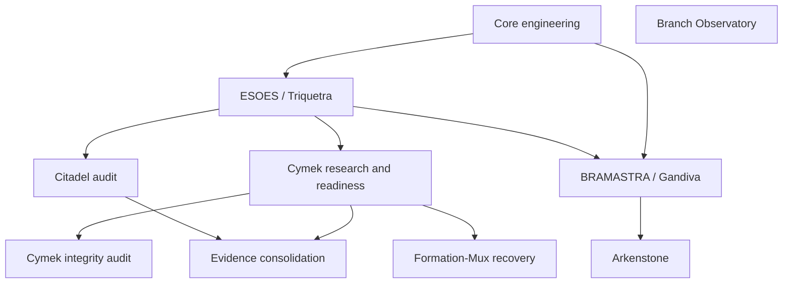

# Project map

This combines Git ancestry measurements with explicitly interpretive program families. Family labels are not encoded by Git and are not automatic authority.

## Branch families

| Family | Purpose | Refs | Evidence owner |
|---|---|---|---|
| **Core engineering** | Portable runtime, training, identity, memory, operator, and engineering spine. | `refs/heads/main`, `refs/remotes/origin/main` | Branch-specific engineering receipts; not a scientific authority. |
| **ESOES / Triquetra** | Evidence base for cognitive probes, selection/realization separation, repair interventions, and claim correction. | `refs/remotes/origin/triquetra` | Triquetra evidence/context and later Citadel audit. |
| **Citadel audit** | Independent contamination, shortcut, provenance, negative-result, and readiness audit. | `refs/remotes/origin/citadel` | Citadel evidence ledger and research protocol. |
| **Cymek research and readiness** | Production-like training path, bounded GPU experiments, transfer/formation questions, and launch gates. | `refs/remotes/origin/cyhex-hermes`, `refs/heads/cyhex-hermes`, `refs/remotes/origin/cymek-500m-readiness`, `refs/remotes/origin/cymek-next-core-architecture`, `refs/remotes/origin/cymek-v51-canary`, `refs/remotes/origin/cymek-cs-transfer-001` | Cymek agent/status/evidence ledger, with branch-specific result records. |
| **Cymek integrity audit** | Receipt, bundle, chronology, and checkpoint custody verification. | `refs/remotes/origin/codex/cyhex-integrity-audit` | CYHEX integrity audit and discrepancy ledger. |
| **Formation-Mux recovery** | Pinned continuation and custody recovery for a partial dual-T4 campaign. | `refs/remotes/origin/cymek-beta` | Session report and recovery runbook; final result absent. |
| **BRAMASTRA / Gandiva** | From-scratch research architecture, owner experiment build, and K8/TPU preparation. | `refs/remotes/origin/Gandiva`, `refs/heads/codex/x-factor-real`, `refs/remotes/origin/BRAMASTRA` | BRAMASTRA evidence audit plus current branch-specific build records. |
| **Arkenstone** | Continual cognition mechanism discovery, retention, invariance, and ARK experiment portfolio. | `refs/remotes/origin/Arkenstone`, `refs/remotes/origin/arkenstone-ark020-v4`, `refs/remotes/origin/arkenstone-astra` | Arkenstone current state, experiment log, and audited result bundles. |
| **Evidence consolidation** | Cross-branch evidence integration, corrections, and architecture decision records. | `refs/heads/research/evidence-consolidation-2026-09-25`, `refs/remotes/origin/research/evidence-consolidation-2026-09-25` | CS-TRANSFER-001 architecture decision and consolidated ledgers. |
| **Branch Observatory** | Durable local measurement, comparison, document indexing, and snapshot verification. | `refs/heads/branch-observatory` | Observatory snapshot and validation report; no scientific claim. |

## Purpose and dependency diagram

## Shared conclusions

- Implementation, local verification, hardware qualification, bounded execution, replication, and broad scientific claims are separate labels.
- Complete-answer termination, held-out boundaries, shortcut/contamination controls, custody, and negative results recur across the records.
- External corpus, target topology, credentials, sealed fixtures, and complete checkpoint custody remain external blockers in multiple ledgers.

## Live disagreements and corrections

- Historical prose and immutable receipts can disagree with newer ledgers; the correction record must be read with the receipt.
- Prelaunch/readiness language is scoped and does not authorize production training or AGI claims.
- Ahead/behind counts measure history, not scientific quality.

## Largest unknowns

- Whether missing external corpora, target topology, sealed custody, and checkpoint trees can be obtained without changing frozen protocols.
- Which bounded development findings replicate on fresh tasks and subjects.
- Which implementation and evidence branches can be compared without mixing purposes or incompatible histories.

## Glossary

| Term | Definition | Source basis |
|---|---|---|
| **AGI** | A broad general-intelligence claim; no branch in this capture is treated as establishing it. | refs/remotes/origin/Gandiva:BRAMASTRA.md § The central decision |
| **BRAMASTRA** | The from-scratch research architecture and experiment program for investigation, transfer, retention, and evidence-bearing improvement. | refs/remotes/origin/Gandiva:BRAMASTRA.md § Research objective and scope |
| **ESOES / Triquetra** | The evidence and context lineage that separates selection, realization, repair, and substrate limitations. | refs/remotes/origin/triquetra:docs/esoes/EVIDENCE_AND_CONTEXT.md § Scientific status entering ESOES |
| **Citadel** | The independent evidence/data audit family with explicit labels, controls, ledgers, and negative-result custody. | refs/remotes/origin/citadel:docs/citadel/RESEARCH_PROTOCOL.md § Labels |
| **Cymek** | The production-like training, evaluation, checkpoint, and experiment-readiness family. | refs/remotes/origin/cyhex-hermes:artifacts/cymek/evidence_ledger.json § basis |
| **Arkenstone** | The continual-cognition mechanism discovery and ARK experiment portfolio. | refs/remotes/origin/Arkenstone:docs/arkenstone/CURRENT_STATE.md § Mission |
| **Receipt** | A committed or externally identified result artifact whose identity and scope must be checked against a ledger or protocol. | refs/remotes/origin/citadel:docs/citadel/RESEARCH_PROTOCOL.md § Receipts are immutable; ledgers are authoritative |
| **Claim ceiling** | The strongest statement permitted by the available controls, substrate, hardware, custody, and replication; it is not upgraded by code volume or prose. | refs/remotes/origin/Gandiva:docs/bramastra/EVIDENCE.md § Consequences |
| **Source stock** | Actual committed-tree line count at a tip, separated from historical additions, removals, and working-tree overlays. | branch_observatory/methodology.md § Line counting |
| **Source flow** | Commit-object numstat additions/removals, with merge first-parent deltas reported separately. | branch_observatory/methodology.md § Daily growth |
| **Formation-Mux** | The pinned multi-stage Cymek campaign whose current branch preserves a partial session and a blocked exact-recovery path. | refs/remotes/origin/cymek-beta:artifacts/cymek/FORMATION-MUX-001/kaggle-session-20260923/RECOVERY_RUNBOOK.md § Status |
| **WORKTREE** | A linked checkout with its own HEAD/index/status overlay; the Observatory reports it separately from committed ref content. | branch_observatory/methodology.md § Worktrees |
