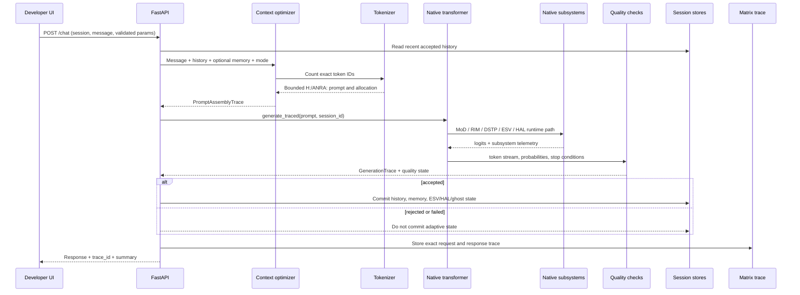
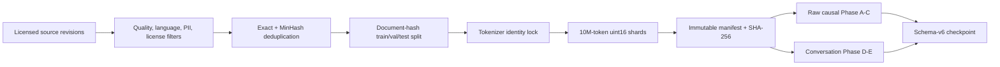

# An-Ra System Architecture

This document follows one prompt from the developer UI to a response and records
where each system may change data, state, or behavior.

## Architectural Contract

An-Ra has four boundaries:

1. **Artifact truth** - checkpoint, tokenizer, model configuration, corpus
   manifests, and source commit must agree.
2. **Request truth** - prompt assembly, generation parameters, and session state
   are explicit and traceable.
3. **Behavior truth** - model output is checked for numerical validity,
   repetition, fragmentation, EOS behavior, and task quality.
4. **Release truth** - no candidate is promoted without reproducible capability,
   subsystem contribution, integration, and rollback evidence.

## End-to-End Request Flow



## 1. Artifact Loading

The runtime must know what it loaded before it can claim to run An-Ra.

### Checkpoint accounting

`training/v2_runtime.py` builds a `CheckpointLoadReport` with:

- loaded tensors;
- named migrations;
- missing and unexpected tensors;
- shape or dtype mismatches;
- newly initialized native tensors;
- checkpoint, tokenizer, vocabulary, special-token, corpus, configuration, and
  source-commit identity where available.

Core embeddings, attention, MLP, normalization, and output-head gaps block
inference. New native calibration parameters may be initialized only through
named, neutral migrations. A permissive `strict=False` load is not release proof.

### Tokenizer identity

The canonical tokenizer has 8,209 IDs. IDs `0-8208` cannot move. Validation uses
metadata hashes and 500 fixed encode/decode probes. Append-only schema V4 growth
may add rows up to 16,384 tokens, but it cannot reassign an original ID.

**Effect on prompt:** text becomes the same token sequence used during training.

**Effect on response:** generated IDs decode with the exact trained vocabulary;
special or invalid control IDs are blocked from ordinary answer sampling.

## 2. API and Session Boundary

`app.py` validates generation input with Pydantic before constructing
`GenerationConfig`. `/chat` accepts a session ID, a user message, and bounded
parameters. Arbitrary dictionaries are not passed unchecked to generation.

Session history contains accepted user/assistant turns. Request-scoped locking
serializes generation while isolation is being proven. Global KV, HAL, ESV, or
ghost mutations are not treated as valid request state.

**Effect on prompt:** supplies only the selected session's recent accepted turns.

**Effect on response:** determines whether accepted state can be committed back
to that same session.

## 3. Full-System Dispatch

In `full_system` mode, explicit operator syntax can route to the native agent or
safe tool layer before model generation. Normal conversation continues through
the model path with optional memory retrieval.

The capability graph describes available operations and integration tests. Tool
execution is bounded by authorization and safe input construction. Evaluation
probes exercise these paths without allowing their state to contaminate real
sessions.

**Effect on prompt:** a handled operator command may bypass language generation;
normal chat may receive retrieved memory.

**Effect on response:** returns either a traced operator result or model output.

## 4. Memory Retrieval

Memory is enabled only in full-system mode. The runtime queries semantic memory,
deduplicates it, scores relevance, and passes candidates to context assembly.
Memory is inserted once.

**Effect on prompt:** high-ranked memories may occupy the reserved memory budget.
Low-ranked memories are discarded before the current message.

**Effect on response:** accepted turns may be stored for later retrieval. Failed
or incoherent generations are not persisted.

## 5. Prompt Assembly

`inference/optimize_context_window.py` uses tokenizer counts, never Python
character counts. The frontier budget is 1,024 tokens, including reserved output.

The target allocation is:

| Segment | Initial budget |
| --- | ---: |
| Generated answer reserve | 128 |
| Identity/system | up to 64 |
| Current message | up to 384 |
| Recent history | up to 224 |
| Retrieved memory | up to 223 |

Unused space is reallocated to the current message and newest history. The full
current message is preserved whenever it fits. Truncation removes oldest history
first and lowest-scoring memory second.

The output is the exact model-facing format:

```text
H: <assembled content>
ANRA:
```

`PromptAssemblyTrace` records the final string, token counts, included turns,
allocation, and every truncation decision.

## 6. Transformer Core

The frontier model is a 28-layer, hidden-size-1280 causal transformer with grouped
query attention (16 query heads, 4 KV heads), RoPE positions, RMS normalization,
SwiGLU feed-forward layers, tied embeddings, and a 1,024-token context.

The model processes prompt tokens causally and produces next-token logits. Native
subsystems modify routing, residual state, attention temperature, or accepted
runtime state; they do not replace the transformer checkpoint.

## 7. Native Mathematical Systems

### MoD: mixture of depth

MoD uses per-token sigmoid gates with straight-through top-k selection. Selected
tokens receive a gated feed-forward update; unselected tokens preserve their
residual. `RouterContext` carries ESV arousal, token entropy, and CIV similarity.

Telemetry includes selected-token ratio, gate entropy, routed-update norm,
balance loss (`0.01`), and z-loss (`0.001`). Capacity begins at `1.0` during
recovery and may be annealed only after validation parity.

**Prompt effect:** controls which prompt-token states receive selected depth.

**Response effect:** controls routed computation for each generated token.

### ESV: emotional state vector

ESV channels are computed per sample across sequence, never across batch. Each
session owns detached state. The channel is normalized before RIM projection.
Training uses verifier-backed labels where available and temporal consistency
otherwise.

**Prompt effect:** supplies bounded per-session arousal/state context to native
routing and modulation.

**Response effect:** may update after an accepted, verified response only.

### RIM: residual identity modulation

RIM projects normalized ESV to `[batch, 1, hidden]` and adds a bounded residual:
`0.25 * tanh(alpha)`. It cannot mix examples across a batch.

**Prompt/response effect:** modulates residual activations by the current sample's
state. Its utility must be positive under ablation.

### DSTP: depth-sensitive temperature

Each layer owns a trainable log temperature bounded to `[0.5, 2.0]`, initialized
from the prior cosine schedule and regularized toward that initialization with
weight `0.001`.

**Prompt/response effect:** adjusts attention sharpness by depth while preventing
unbounded temperature drift.

### Residual depth

Depth scales remain centered around `1.0` with a deviation penalty. This prevents
layers from silently collapsing their contribution.

### HAL: adaptive regulation

HAL responds to verifier evidence, coherence, repetition, task success, and CIV
signals. Confidence alone cannot reward output. During recovery it updates after
verification, with generation-temperature adjustment bounded to `+/-0.10` and
attention-temperature adjustment bounded to `+/-15%`.

**Prompt effect:** prior accepted session state may provide bounded controls.

**Response effect:** accepted evidence can update the session state; rejected
output restores the prior state.

## 8. Generation

The reference path is greedy, fixed seed, KV cache off. Other validated strategies
include nucleus, top-k, beam, and contrastive generation.

Generation enforces:

- finite-logit and finite-probability checks;
- PAD, BOS, and invalid-control-token blocking;
- repetition penalty on generated answer tokens only;
- correct signed-logit repetition mathematics;
- repeated n-gram stopping;
- EOS and stop-string handling;
- language-fragment detection;
- explicit stop and quality reasons;
- a hard context/cache boundary of 1,024 tokens.

KV cache positions use the true absolute rotary offset for every incremental
token. Cache use remains blocked until cached and uncached output-token parity is
verified.

## 9. Verification and Persistence

`GenerationTrace` contains output text and IDs, entropy/max-probability curves,
timing, prompt/output counts, stop reason, repetition and fragment flags, mode,
quality state, and subsystem telemetry.

Only an accepted generation commits:

- user and assistant history;
- semantic memory;
- detached ESV state;
- HAL state;
- ghost state.

Evaluation uses `persist_adaptive_state=False`, preventing benchmark prompts from
changing real interactive state.

## 10. Trace and Matrix

The backend stores a request trace and returns its ID. `GET /traces/{trace_id}`
joins:

- request and session identity;
- exact formatted prompt and context trace;
- retrieved memories;
- validated generation configuration;
- complete generation trace;
- persistence outcome.

The Matrix combines this with `/evaluations/current`, `/phase-health`, and
`/diagnostics/release-evidence` so a developer can move from one answer to the
artifact and subsystem evidence behind it.

## Training Data Flow



Raw foundation documents use causal packing and supervise every non-padding next
token. Instruction examples use conversation packing with answer/EOS emphasis.
Every checkpoint records enough artifact identity to reject silent corpus or
tokenizer substitution on resume.

## Release Evidence Flow

Promotion requires checkpoint accounting, tokenizer proof, cache parity, session
isolation, validation stability, corpus/config manifests, rollback, recovery gate,
private promotion evaluation, full-system integration, and a signed bundle. The
bundle is bound to artifact hashes and the source commit and is rehashed during
verification.

No architectural diagram or successful unit test substitutes for real checkpoint
behavior. The release gates are the boundary between an implemented mechanism and
a demonstrated capability.
