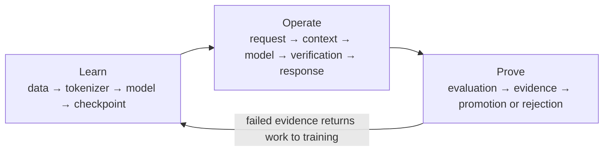
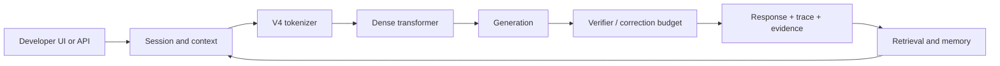

# An-Ra Architecture

Updated: 2026-07-23  
Purpose: explain what the repository is, how its parts connect, and which parts
are real, experimental, disabled, or historical.

## The mental picture

An-Ra is not one giant Python file and it is not a collection of independent
“AGI features.” It is a pipeline with three responsibilities:



**Learn** creates model weights. **Operate** uses those weights and adds
updatable capabilities such as retrieval, memory, verification, and tools.
**Prove** decides whether a result deserves trust. A feature is not part of the
canonical model merely because its source file exists.

## Truth hierarchy

When two descriptions disagree, use this order:

1. Signed launch and checkpoint manifests for a particular run.
2. Executable contracts in `training/v2_config.py`,
   `training/launch_manifest.py`, and `runtime/subsystem_catalog.py`.
3. Generated `docs/system_graph.json`.
4. This explanatory document.
5. Historical discussion in `docs/engineering/ENGINEERING_LOG.md`.

The system graph reports file presence and declared maturity. It does not turn
presence into health. Health requires runtime or evaluation evidence.

## Learn: how model weights come into existence

### 1. Data

Licensed sources enter through the acquisition and corpus-manifest pipeline.
Every accepted source must retain revision, license, size, hashes, cleaning
decisions, split identity, and tokenizer identity. Cleaning and
deduplication happen before deterministic train/validation packing.

The local corpus is larger than a single cloud session. Training therefore
uses immutable token packs. A pack is a signed window, not a new model and not
an independent seed. A later pack starts at the previous global token boundary
but resets its own local permutation cursor.

Primary implementation:

- `scripts/download_training_data.py`
- `training/data_pipeline.py`
- `training/corpus_manifest.py`
- `training/curriculum_sampler.py`

### 2. Tokenizer

The only operational tokenizer is V4:

| Property | Canonical value |
| --- | ---: |
| Vocabulary | 32,768 |
| Artifact | `tokenizer/tokenizer_v4_32k.json` |
| Lineage | Append-only V4 |
| Context target | 2,048 tokens |

V3 is retired. Its name may appear in history, migration tests, or archived
evidence, but a new signed run cannot select it.

### 3. Dense foundation model

The first model is deliberately one stable dense baseline:

| Property | `anra-v4-180m` |
| --- | ---: |
| Exact parameters | 181,132,071 |
| Layers | 18 |
| Width | 896 |
| Query heads / KV heads | 14 / 2 |
| Head dimension | 64 |
| Feed-forward width | 2,432 |
| Vocabulary / context | 32,768 / 2,048 |
| Optimizer | AdamW |
| Routine seed | 1301 |

The transformer uses grouped-query attention, QK normalization, RoPE, tied
input/output embeddings, stable residual initialization, and a declared hybrid
full/sliding attention pattern. The routine seed makes the run reproducible; it
does not represent three competing models.

Primary implementation:

- `anra_brain.py`
- `anra/architecture.py`
- `training/v2_config.py`
- `scripts/build_brain.py`

### 4. Training and exact continuation

`training.train_unified` dispatches the registered foundation milestones. A
signed `anra-training-contract/v4` binds the source commit, tokenizer, data
manifests, architecture, optimizer, seed, token window, checkpoint parent,
artifact destinations, and resource limits.

A full-resume checkpoint preserves:

- model, optimizer, scheduler, and scaler;
- Python, NumPy, CPU, and CUDA RNG state;
- completed optimizer boundary and accumulation state;
- sampler cursor and accepted token window;
- source commit, architecture, tokenizer, data, and recipe hashes.

The durability system divides the immutable checkpoint into 128 MiB
content-addressed chunks. Uploads resume from verified offsets. A canonical
pointer is published only after every chunk is present and hash-verified.

Durability states are:

`local_saved → staged → canonical_verified → protected`

`full_resume` may continue training. `fp16_inference` contains model weights
only and is structurally rejected by resume code.

### 5. Controlled model growth

The only registered larger child is:

| Property | `anra-v4-500m-growth` |
| --- | ---: |
| Exact parameters | 499,880,031 |
| Layers | 27 |
| Width | 1,280 |
| Query heads / KV heads | 20 / 2 |
| Feed-forward width | 3,456 |

It cannot start from scratch. Cross-scale identity inheritance maps the trained
181M parent into the child, preserves attention modes, inserts identity
residual blocks, binds the parent hash, checks real logits parity, starts a
fresh AdamW optimizer, and then uses low-rate alignment and progressive
unfreezing. The 181M hot checkpoint vault is capped at 12 GiB; the larger
growth lineage permits 32 GiB.

## Operate: how a message becomes an answer



The model supplies learned language behavior. Retrieval supplies current,
attributable knowledge without changing base weights. Memory stores selected
facts and outcomes. The self-correction engine can retrieve, plan, generate,
verify, revise, or abstain within an explicit budget. Tools and agents are
outside the base transformer and remain permission-gated.

Important runtime paths:

- `app.py`: FastAPI and Developer UI.
- `generate.py`: generation and trace construction.
- `inference/`: context, adapters, cache, sampling, and reasoning budgets.
- `retrieval/` and `memory/`: external knowledge and persistence.
- `cognition/self_correction.py`: verifier-guided correction orchestration.
- `agents/` and `execution/`: typed action planning and sandboxing.

## Prove: how claims become accepted or rejected

Training loss is one signal. It cannot establish language quality. The proof
layer evaluates source-stratified validation, coherent generation, collapse and
repetition, context use, uncertainty, reasoning, code, retrieval, correction,
and rollback.

ThirdEye explains a run or behavior. Matrix aggregates operational state. Both
consume the same hash-chained evidence contract; they are views, not competing
truth systems.

Important proof paths:

- `training/eval_v2.py`
- `evaluation/ibs.py`
- `evaluation/promotion.py`
- `evaluation/thirdeye_adapter.py`
- `runtime/evidence_stream.py`
- `engine/telemetry.py`

## Subsystem lifecycle

| Subsystem | Current role | Meaning |
| --- | --- | --- |
| Dense V4 | Active | Canonical trainable foundation |
| Exact resume and durability | Active | Required for every cloud lineage |
| Retrieval and memory | Active runtime | External, updateable knowledge |
| MTP | Pilot | Real objective; needs matched capability evidence |
| MoD, RIM, ESV, DSTP | Disabled baseline | Tested only one at a time |
| External HAL | Pilot | Bounded runtime policy |
| Transformer HAL | Disabled | Cannot affect the baseline |
| Current MoE | Disabled | Geometry is too large for the T4 foundation |
| Self-correction | Pilot | Contracts exist; trained-model gate remains |
| SFT/RLVR/STaR/DPO | Pilot | Data/evidence contracts exist; real runs remain |
| LoRA/DoRA adapters | Pilot | Reversible capability path |
| Agents and tools | Disabled | Await useful model and permission evidence |
| Moonshots | Pilot laboratory | Never enter canonical training automatically |
| Multimodal/world/robotics | Disabled research | Later capability stages |

The executable version of this table is `runtime/subsystem_catalog.py`.

## Cluster boundary

An-Ra owns model truth. The separate GPU Cluster repository owns leases,
worker authentication, scheduling, handoff, and artifact movement. They share
JSON contracts and signed evidence; neither imports the other’s Python
internals.

Only one worker advances canonical weights. Other authorized workers prepare
data, evaluate immutable checkpoints, run bounded pilots, or archive evidence.
Separate Colab machines never average gradients. True DDP/FSDP is allowed only
on one low-latency multi-GPU host after the runtime implements it.

## What this architecture does not claim

- It does not prove AGI.
- It does not prove the untrained 181M model is useful.
- It does not promote MTP, MoE, HAL, or a moonshot from source presence.
- It does not make a compact inference artifact resumable.
- It does not make multiple unrelated Colab machines one synchronous GPU.

## Live truth sources

Use these whenever this prose may be stale:

- Model profiles: `training/v2_config.py`
- Signed run schema: `training/launch_manifest.py`
- Checkpoint protocol: `training/checkpoint_durability.py`
- Subsystem state: `runtime/subsystem_catalog.py`
- Generated map: `docs/system_graph.json`
- Runtime state: `GET /system-map`, `GET /phase-health`, `GET /evidence/status`
- Forward work: `TODO.md`

Refresh the generated map:

```powershell
.\.venv-cuda\Scripts\python.exe -c "from runtime.system_registry import write_system_manifest; write_system_manifest()"
```
