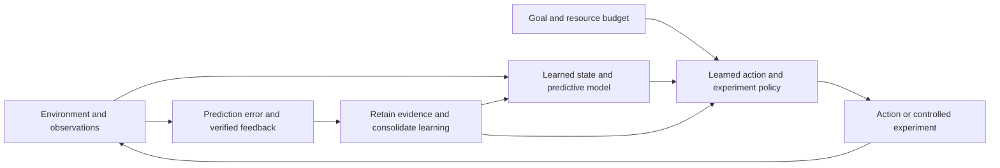

# The system we are trying to build

The owner's correction is central: An-Ra's destination is an intelligence that can discover, experiment, and build its capabilities from scratch. A static benchmark-trained model is insufficient. The system must eventually learn to select useful actions and experiments, interpret their outcomes, and consolidate what it learns.

This changes the organizing blueprint. Binding and complete-answer generation are prerequisites and instruments. The research loop is the target system. We must distinguish the research decisions Codex makes while building it, the decisions an ordinary controller implements, and decisions the newly trained model actually learns to make.

## The intended loop

These are functional roles, not a prescription to create six networks. A shared core can represent state, predict outcomes, and select actions. Explicit replay and an execution layer can supply persistence and enforce action budgets. The evaluator remains independent: the learner cannot award itself success.

The core starts with random weights. It must learn its useful representations and action choices. Reusing an optimizer, byte encoding, or a simulator implementation is ordinary engineering; importing pretrained cognitive weights is outside the owner's requirement.

## What would count as discovery

The system encounters a new environment with initially unknown rules. Before an experiment, it predicts possible outcomes and commits what would change its belief. It selects an action using only observations available at that time. It sees the outcome, updates its state or parameters, and applies the inferred regularity to an unobserved case.

An initial testbed can expose simple hidden rules in symbolic worlds. Held-out rules, combinations, observation costs, and renderings must prevent solving the test by a memorized answer table. This is an explicit starting assumption, not a claim that synthetic worlds establish general intelligence.

Compare learned experiment choice against random sampling, a fixed curriculum, uncertainty-only sampling, and a strong transparent information-seeking rule. Charge the cost of observations, planning, training, and inference. Success means improved held-out prediction and task completion per budget, not merely more experiments or a plausible explanation.

## Bootstrap without pretending autonomy already exists

| Stage | Who chooses the experiment? | What the core learns | Evidence required |
|---|---|---|---|
| Current construction | Codex plus a transparent fixed controller | Answer behavior in a bounded from-scratch experiment | Working updates, scoring, and continuation; no autonomy claim |
| Interactive learner | Initially a fixed exploration policy | State/outcome prediction from observed transitions | New-world prediction and action consequences |
| Learned exploration | Core policy trained from its own permitted experience | Which observation or intervention is useful | Advantage over the exploration baselines at equal cost |
| Capability consolidation | Learned policy proposes; independent tests decide promotion | Reusable computations and retained skills | Multiple acquisitions, fresh retention tests, and transfer |
| Open-ended research | System proposes new hypotheses and experiments | A growing repertoire across environments | New domains and problem types with declining manual specification |

The first implementation is `bramastra_lab/`. Its `decide()` function is a visible, fixed triage rule. It does not learn, understand, or discover. The neural core inside the experiment is trained from scratch; those two facts must not be conflated.

## The first hypothesis and what follows it

The historical audit exposed a mismatch between training supervision and generation stopping. The implemented first experiment tests that mismatch directly while holding initial weights, examples, sampled batches, update count, and answer-loss weighting fixed.

The next decision is driven by the result: if complete answers become learnable but fresh-world success remains poor, the next research target is generalization through varied experience. Scaling the model, adding an autonomous controller, or declaring a world model at that point would skip the unresolved learning question.

An interactive environment becomes valuable once the model can learn an observation-to-outcome relationship with a valid output contract. The eventual policy can then choose observations itself. We need not finish a large language pretraining campaign before constructing this testbed, but we do need a learnable and interpretable task before crediting a learned experiment policy.

## Open scientific problems

The plan does not resolve how far a small core can generalize, how to represent uncertainty reliably, how to avoid forgetting over long histories, how to learn useful abstractions across domains, or how to obtain trustworthy feedback for tasks without exact verifiers. Text-only synthetic success would also leave sensory grounding and many forms of real-world intelligence untested.

These uncertainties define the research program. Architecture changes should be proposed as hypotheses about a measured limitation, tested, and retained only when they improve the evidence. AGI remains the destination; the committed results describe only what has actually been demonstrated.
