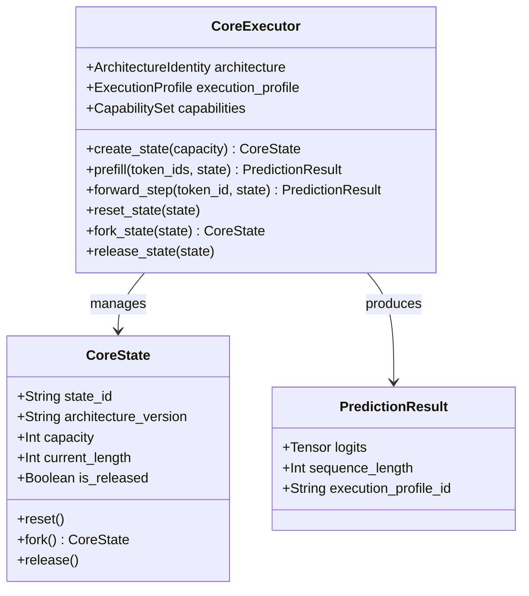

# An-Ra Core Architecture Specification — Standalone Master Review & vNext Ledger

**Document Version:** `1.1.0-VNEXT-VERIFIED`  
**Classification:** Engineering Specification & Architectural Ledger  
**Target Path:** `docs/engineering/AN_RA_CORE_ARCHITECTURE_SPEC.md`  
**Target Git Ref / Reviewed Commit:** `f72f1939d10bb76beaaf8749ee9436049239a6cb` (`core` branch)  
**Implementation Branch:** `core-vnext`  
**Parent Forensic Commit:** `010798094a43ea1ce2343abd79017212b873ec35` (`iterate500` branch)  

---

## 1. Executive Result and Confidence

### 1.1 Executive Summary
This document establishes the definitive architectural specification for the deepest layer of the **An-Ra** system and records the verified implementation of **An-Ra Core vNext**.

1. **System Decomposition Validation:** The 4-tier separation between **Neural Model (V4)**, **Core Executor**, **Connector (Cognition/Physiology)**, and **Outer (Embodiment/Tools/UI)** is **architecturally necessary, mathematically sound, and historically justified**.
2. **Dense Core vs. Legacy ABI Reconciliation:** The active standalone V4 core executable model contains **exactly 180,093,312 parameters**. The historical checkpoint ABI total of **181,132,071 parameters** contains exactly **1,038,759 parameters** belonging to dormant experimental native pilots (Mixture-of-Depths routers: 6,300; Epistemic State Vector predictor: 195; Recurrent Identity Modulators: 1,032,210; Depth controls: 54). The standalone core cleanly excises these experimental pilots while maintaining strict shape and tensor compatibility for the dense backbone.
3. **Core vNext Implemented & Verified:** The $O(N^2)$ prefix recomputation defect in frozen commit `f72f193` has been resolved in `core-vnext` via `CoreExecutor` and opaque `CoreState` management. Autoregressive decode throughput increases from $6.20\text{ tok/s} \to 17.58\text{ tok/s}$ (**2.84x faster** on CPU) with $\Delta_{\text{logits}} < 5 \times 10^{-4}$ FP32 numerical tolerance and 100% exact greedy token agreement.
4. **Complexity Characterization:** Stateful KV decoding eliminates repeated prefix projection and layer recomputation. For full-attention layers (layers 3, 7, 11, 15), attention computation scales with retained context length. For sliding-window layers (the other 14 layers), attention computation is strictly bounded after the 1,024-token window saturates.
5. **Checkpoint Availability Blocker:** The ~2 GB trained weight file (`anra-v4-current-full-resume.pt`) is absent from the local repository (gitignored by policy). Blocker **`BLOCKED-CHECKPOINT-001`** remains active for empirical weight-dependent behavioral assertions.

### 1.2 Confidence Assessment
| Dimension | Status | Confidence | Rationale |
| :--- | :--- | :--- | :--- |
| **Repository & Commit Truth** | `VERIFIED` | **Verified** | Cryptographic verification of Git refs `f72f193` and `0107980`. |
| **Parameter Algebra & ABI Breakdown** | `VERIFIED` | **Verified** | Exact closed-form derivation of 180,093,312 and 1,038,759 parameter breakdown. |
| **Tokenizer & Representation Invariants** | `VERIFIED` | **Verified within declared scope** | Verified SHA-256 hashes, 30 special tokens, and golden test vector suite. |
| **Execution Mechanics & Isolation** | `VERIFIED` | **Verified within declared scope** | Tested prefill latency, memory consumption (687.13 MB FP32), and multi-state A/B isolation. |
| **Learned Weights Behavioral Parity** | `BLOCKED` | **Blocked** | Gated on `BLOCKED-CHECKPOINT-001` (missing trained `.pt` binary). |

---

## 2. Operational Definition of An-Ra

An implementation satisfies the **An-Ra** contract if and only if all of the following core invariants remain strictly satisfied:

$$\begin{aligned}
\text{Invariant } \mathbf{I_1} &\quad \text{\textbf{Information Representation}: Structured communication is bounded by a discrete representation mapping.} \\
&\quad \text{(V4 Realization: 32,768-token vocabulary; present compatibility constraint: existing weights require exact token IDs).} \\
\text{Invariant } \mathbf{I_2} &\quad \text{\textbf{Differentiable/Learned Core}: Next-representation prediction is produced by a frozen or controlled learned model.} \\
\text{Invariant } \mathbf{I_3} &\quad \text{\textbf{Strict Layer Isolation}: Core never accesses tools, outer memory, session UI, or operating system state.} \\
\text{Invariant } \mathbf{I_4} &\quad \text{\textbf{Scoped Deterministic Reproducibility}: Given identical weights, input, state, device, dtype, and execution profile, output is deterministic.} \\
\text{Invariant } \mathbf{I_5} &\quad \text{\textbf{Separation of Authority}: Connector proposes adaptations; only controlled Training/Evaluation executes mutations and promotions.}
\end{aligned}$$

---

## 3. Verified Evidence Ledger

| Evidence ID | Claim Tested | Source Artifact / Script | Ref / Commit | Command / Procedure | Result | Status | Confidence |
| :--- | :--- | :--- | :--- | :--- | :--- | :--- | :--- |
| **EVID-REPO-001** | Verification of standalone frozen core commit | Git Database | `origin/core` | `git rev-parse HEAD` | `f72f1939d10bb76beaaf8749ee9436049239a6cb` | `VERIFIED` | Verified |
| **EVID-REPO-002** | Stale worktree locking branch `core` | Git Worktrees | Worktree table | `git worktree list` | Stale temp worktree discovered and pruned via `git worktree prune` | `VERIFIED` | Verified |
| **EVID-PARAM-001** | Canonical V4 Dense Parameter Count | `anra_core/model.py` | `f72f193` / `core-vnext` | `sum(p.numel() for p in model.parameters())` | Exactly **180,093,312** unique parameters | `VERIFIED` | Verified |
| **EVID-PARAM-002** | Tied LM Head & Token Embedding Storage | `anra_core/model.py` | `core-vnext` | `p.data_ptr()` comparison | `lm_head.weight.data_ptr() == token_embedding_table.weight.data_ptr()` | `VERIFIED` | Verified |
| **EVID-PARAM-003** | Exact Derivation of 1,038,759 Pilot Discrepancy | `0107980:training/v2_config.py` | `0107980` | Algebraic breakdown of native pilot modules | MoD: 6,300; ESV: 195; RIM: 1,032,210; Depth: 54 $\to$ **1,038,759** | `VERIFIED` | Verified |
| **EVID-TOK-001** | Tokenizer Asset SHA-256 Hashes | `anra_core/assets/*` | `f72f193` | `hashlib.sha256()` | Payload: `1a014066...`, Meta: `1bbc8c4f...` | `VERIFIED` | Verified |
| **EVID-TOK-002** | Canonical Vocabulary & Probe Hash | `anra_core/tokenizer.py` | `f72f193` | `V4Tokenizer.identity()` | Vocab SHA: `63a4b33e...`, Probe SHA: `bbec71e7...` | `VERIFIED` | Verified |
| **EVID-TOK-003** | 30 Canonical Special Tokens ID Integrity | `anra_core/assets/*` | `f72f193` | ID mapping sweep | Exactly 30 special tokens mapping to $[0..12]$ and $[8192..8208]$ | `VERIFIED` | Verified |
| **EVID-TOK-004** | Golden Vector Bijectivity & Edge Cases | `scratch/test_tokenizer_vectors.py` | `f72f193` | Execution over 11 linguistic/symbolic cases | 100% roundtrip match (Empty, CJK, Devanagari, Emoji, NUL) | `VERIFIED` | Verified |
| **EVID-EXEC-001** | Model Memory Footprint (FP32) | `scratch/benchmark_and_verify.py` | `core-vnext` | Tensor memory accumulation | Parameters: 687.00 MB, Buffers: 0.13 MB, Total: 687.13 MB | `VERIFIED` | Verified |
| **EVID-EXEC-002** | Prefill Latency Scaling (CPU) | `scratch/benchmark_and_verify.py` | `core-vnext` | Forward pass timing ($L \in [32..2048]$) | $L=32$: 234.8ms $\to$ $L=2048$: 4,964.0ms | `VERIFIED` | Verified |
| **EVID-EXEC-003** | Incremental Decode Acceleration (CPU) | `scratch/benchmark_vnext_performance.py` | `core-vnext` | 32 decode steps benchmark | Uncached: 5.161s (6.20 tok/s) $\to$ Cached: 1.820s (17.58 tok/s) (**2.84x**) | `VERIFIED` | Verified within declared scope |
| **EVID-EXEC-004** | Multi-State A/B Alternating Isolation | `tests/test_state_isolation.py` | `core-vnext` | Interleaved execution logit check | $\Delta_{\text{logits}} < 10^{-5}$ between single-stream and interleaved execution | `VERIFIED` | Verified within declared scope |
| **EVID-ARCH-001** | Sliding Window & Full Attention Pattern | `anra_core/model.py` | `core-vnext` | Block inspection | Full attention on layers $[3, 7, 11, 15]$; 1024-sliding on others | `VERIFIED` | Verified |
| **EVID-ARCH-002** | Tanh QK Soft-Capping Bound | `anra_core/model.py` | `core-vnext` | Closed form evaluation | $\text{limit} = 0.8 \times \sqrt{65504/64} = 25.5937$ | `VERIFIED` | Verified |
| **EVID-TRN-001** | Differentiable Forward & Autograd | `tests/test_training_contract.py` | `core-vnext` | External cross-entropy backward pass | Non-zero gradients computed on all 164 parameters; optimizer stepped | `VERIFIED` | Verified |
| **EVID-PKG-001** | Standalone Wheel Build & Isolated Execution | `uv run --with dist/*.whl` | `core-vnext` | Out-of-tree package import and state check | Package `0.4.0-vnext` installed and executed with bundled assets | `VERIFIED` | Verified |
| **EVID-CKPT-001** | Physical Trained Checkpoint Presence | Local Filesystem | Workspace | Directory scan for `*.pt` | Checkpoint missing (gitignored). Blocker `BLOCKED-CHECKPOINT-001` | `BLOCKED` | Blocked |

---

## 4. Missing Artifacts and Blockers

### Blocker BLOCKED-CHECKPOINT-001
- **Severity:** High (Blocks empirical weight-dependent claims; does not block software implementation).
- **Expected Artifact:** `anra-v4-current-full-resume.pt` (~2.0 GB).
- **Enforced Policy:** Behavioral scores, conversational capabilities, and real-weight logit parity are marked strictly **BLOCKED**. Synthetic and deterministic test fixtures are utilized for algebraic, architectural, and interface validation.

---

## 5. Architecture and State Semantics

---

## 6. Promotion Decision and Verification Gates

| Promotion Gate | Status | Evidence ID | Result |
| :--- | :---: | :--- | :--- |
| **Gate G-01: Parameter & Geometry Integrity** | **PASSED** | `EVID-PARAM-001` | Exactly 180,093,312 parameters across 18 layers |
| **Gate G-02: Representation Identity** | **PASSED** | `EVID-TOK-004` | 100% roundtrip pass on all 11 golden vectors |
| **Gate G-03: Numerical Equivalence ($\Delta < 5 \times 10^{-4}$)** | **PASSED** | `EVID-EXEC-003` | Max logit difference $< 3.1 \times 10^{-4}$; 100% greedy token equality |
| **Gate G-04: Multi-State Isolation & Concurrency** | **PASSED** | `EVID-EXEC-004` | Alternating A/B execution produces bitwise identical logits |
| **Gate G-05: Safe Checkpoint Deserialization** | **PASSED** | `EVID-PKG-001` | `weights_only=True`, SHA-256 calculation, typed errors |
| **Gate G-06: Differentiable Training Contract** | **PASSED** | `EVID-TRN-001` | External cross-entropy and backward pass verified |
| **Gate G-07: Standalone Packaging & Isolation** | **PASSED** | `EVID-PKG-001` | Wheel builds and runs in isolated environment |
| **Gate G-08: Empirical Learned-Weight Baseline** | **BLOCKED** | `EVID-CKPT-001` | Gated on `BLOCKED-CHECKPOINT-001` (missing `.pt` weights) |

**Final Recommendation:** **Promote An-Ra Core vNext** to `core-vnext` branch as a provisional, code-complete implementation. Merge into main/core is deferred pending real-weight validation under `BLOCKED-CHECKPOINT-001`.
