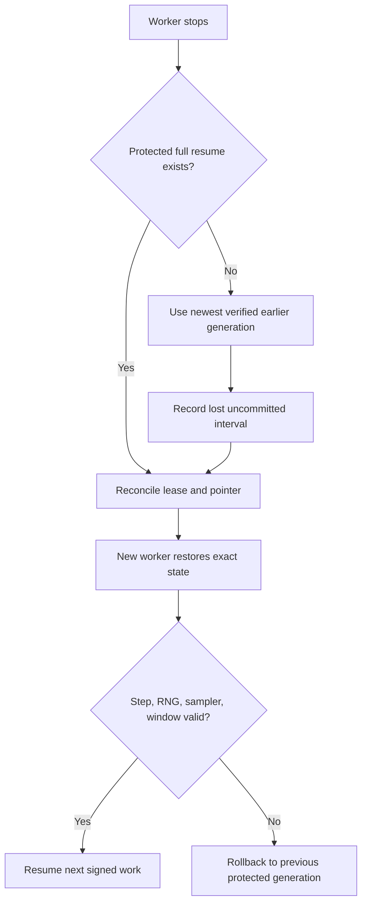

# V4 Model Training and Recovery Blueprint

Updated: 2026-07-23  
Purpose: provide the operational route from a clean repository and immutable
data to a useful, resumable 181M model and its controlled 500M child.

## Canonical target

Train one lineage:

```text
anra-v4-180m
  → coherent pretrained checkpoint
  → signed post-training stages
  → function-preserving anra-v4-500m-growth child
```

Do not maintain V3/V4 alternatives, arbitrary parameter sizes, or simultaneous
canonical writers.

## Phase 0: freeze source and inputs

Required:

- clean, pushed An-Ra commit;
- V4 tokenizer plus metadata sidecar;
- immutable train and validation manifests;
- source/license/deduplication/contamination evidence;
- deterministic token pack;
- owner-held manifest signing key;
- remote hot checkpoint vault and laptop archive.

Run the cluster integration verifier before spending GPU time:

```powershell
Set-Location "C:\Users\ankit\Downloads\gpu cluster"
.\.venv\Scripts\python.exe scripts\verify_anra_integration.py `
  --anra-repo "C:\Users\ankit\Downloads\An-Ra-the-new-AGI-1"
```

## Phase 1: create a signed launch

From the clean An-Ra checkout:

```powershell
$env:ANRA_MANIFEST_SIGNING_KEY = "<owner-held secret>"
.\.venv-cuda\Scripts\python.exe scripts\create_cloud_launch.py `
  --pack-root "C:\path\to\first-pack" `
  --output "output\v2\cluster_launch_000.json" `
  --artifact-path "output/v2/checkpoints/anra-v4-180m.pt" `
  --checkpoint-source scratch `
  --worker-id trainer-1 `
  --runtime-estimate-hours 3 `
  --model-profile anra-v4-180m `
  --stage canary
```

The launch must bind the same commit cloned by the worker. The output path
must not already contain a stale scratch artifact.

## Phase 2: short live canary

Run 10–15 minutes on one provider-authorized T4. The canary is accepted only
when:

- CUDA is genuinely active;
- forward, backward, AdamW step, and checkpoint save are finite;
- the first remote full-resume artifact becomes `canonical_verified`;
- its chunks and manifest verify;
- telemetry reports real steps, tokens, throughput, loss, and GPU memory.

Do not spend the session on repeated broad tests.

## Phase 3: forced handoff

Before long training:

1. Stop or drain the canonical trainer after a protected checkpoint.
2. Expire/reconcile its lease.
3. Allow a standby worker to claim a new attempt.
4. Restore the verified `full_resume`.
5. Verify monotonic optimizer step, tokens, and sampler cursor.
6. Confirm the next signed token interval does not overlap accepted work.
7. Verify the checkpoint SHA-256 independently on the laptop.

Failure here blocks the campaign. Fix the baton before buying more training.

## Phase 4: dense foundation milestones

Continue the same seed-1301 lineage:

| Milestone | Purpose |
| ---: | --- |
| 200M tokens | First useful behavioral and architecture-pilot parent |
| 500M tokens | Confirm learning curve and source balance |
| 1B tokens | Deeper behavioral and context evaluation |
| ~3.6B tokens | Initial dense foundation target |

The inspected corpus contains roughly 11.4B V4 tokens. That is the available
lineage, not an instruction to consume all tokens blindly. Extend only when
learning curves, data quality, and budget justify it.

Training health is cheap and continuous. Full behavioral suites run only at
milestones.

## Phase 5: architecture selection

Freeze the 200M checkpoint and run paired pilots:

1. Dense continuation versus MTP.
2. MoD alone.
3. RIM/ESV alone or in their explicitly defined paired contract.
4. DSTP alone.
5. Transformer-integrated HAL alone.

Use identical parent, seed, optimizer, data order, and token budget. Promote
only a positive capability/stability/useful-compute result.

The existing MoE geometry is disabled. Redesign sparse upcycling before testing
it against the T4 baseline. Moonshots remain separate pilots.

## Phase 6: post-training

After coherent base language:

- build an audited SFT manifest covering instruction, dialogue, code, math,
  decomposition, tools, uncertainty, and correction;
- run SFT as a new signed lineage;
- use RLVR/STaR for verifiable outcomes;
- use DPO only with audited preference pairs;
- evaluate correction, abstention, and instruction adherence.

The repository currently contains contracts and gates for these stages, not an
accepted post-trained V4 model.

## Phase 7: external capabilities

Add in order:

1. provenance-grounded retrieval;
2. long-term memory with isolation;
3. verifier-guided correction;
4. typed, permissioned tools;
5. agent planning;
6. reversible LoRA/DoRA adapters.

These capabilities should be replaceable and auditable. They must not silently
modify the canonical base checkpoint.

## Phase 8: grow to 500M

Requirements:

- useful frozen 181M parent;
- parent full-resume hash;
- signed growth manifest;
- attention-mode mapping;
- identity-initialized inserted blocks;
- full-model logits parity;
- fresh AdamW declaration;
- 32 GiB hot-vault budget.

Run low-rate teacher alignment and progressive unfreezing before normal
continuation. If parity is poor, fix mapping; do not assume training will repair
an incorrectly inherited child.

## Checkpoint and storage policy

Save every 200 optimizer steps or 60 minutes. Publish the first remotely
verified checkpoint before a scratch campaign continues.

Keep:

- two protected full-resume generations;
- two compact FP16 inference generations;
- one in-flight slot;
- laptop authoritative archive;
- optional cold OneDrive replica.

The previous resume checkpoint survives until its replacement is protected.
The corpus does not belong in the checkpoint hot folder.

## Automatic pause conditions

- NaN/Inf or persistent loss explosion;
- severe behavioral collapse;
- wrong source, tokenizer, model, or data hash;
- missing durability acknowledgement;
- corrupt chunk or pointer;
- duplicate token interval;
- stale worker commit;
- major source-stratified validation regression;
- insufficient drain/storage reserve.

## Recovery decision tree



Never recover from `fp16_inference`. Never overwrite the damaged artifact
before preserving forensic evidence.

## Completion definition

The blueprint succeeds when:

- a killed worker loses at most one checkpoint interval;
- full state resumes at the exact optimizer/data boundary;
- the 181M model produces coherent post-trained behavior;
- enabled subsystems have matched comparative evidence and rollback;
- the 500M child passes parity before continued training;
- release evidence is reproducible and auditable.

It creates a serious intelligence-research foundation. It does not guarantee
AGI.

## Live truth sources

- Exact profiles: `training/v2_config.py`
- Launch schema: `training/launch_manifest.py`
- Training dispatcher: `training/train_unified.py`
- Trainer: `scripts/build_brain.py`
- Durability: `training/checkpoint_durability.py`
- Growth: `training/csii.py`, `training/growth_runtime.py`
- Cluster machine contract:
  `../gpu cluster/contracts/anra-training-contract.v4.json`
- Current remaining work: `TODO.md`
- Run-specific truth: signed launch, checkpoint manifest, replica receipts,
  and evidence events

A real run’s signed artifacts override example values in this blueprint.
