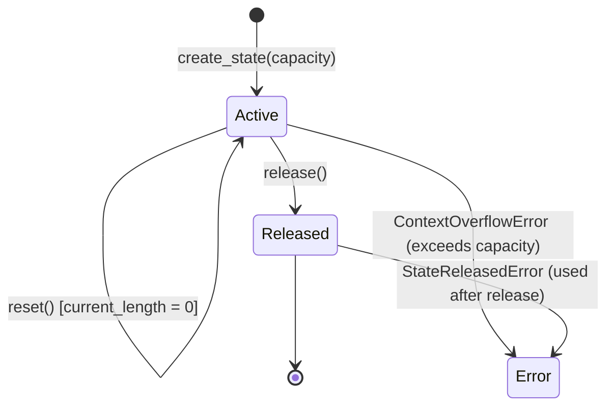

# An-Ra Core vNext — State Semantics and Lifecycle Specification

**Document Version:** `1.0.0`  
**Classification:** Core Runtime Specification  
**Target Path:** `docs/engineering/STATE_SEMANTICS.md`

---

## 1. What is `CoreState`?

`CoreState` is an opaque hardware-backed execution acceleration artifact containing Key-Value (KV) cache activations for the 18-layer grouped-query attention decoder.

### Invariant Principles
1. **Derivability:** `CoreState` is 100% deterministically derivable from the input representation token prefix.
2. **Isolation:** Every `CoreState` instance owns its internal tensor memory. Stepping, modifying, resetting, or releasing `State A` has strictly zero effect on `State B`.
3. **Reentrancy:** The `CoreExecutor` is stateless and reentrant; multiple independent `CoreState` instances can be interleaved through a single model instance safely.
4. **No Session/UI Pollution:** `CoreState` does not store usernames, chat roles, timestamp history, or UI markdown.

---

## 2. State Lifecycle States

---

## 3. Attention Window Scheduling & Cache Semantics

The 18 transformer layers follow a hybrid schedule:
- **Full Attention Layers (Layers 3, 7, 11, 15 - 0-indexed):** Retain all KV cache history up to `capacity` (2048 tokens). Attend across all previous tokens.
- **Sliding Window Layers (All other 14 layers):** Key-Value cache accumulates prefix tokens. During decode, attention is computed only over the most recent `sliding_window` (1024) tokens.

---

## 4. Complexity and Latency Truth

- **Uncached Autoregressive Generation:** Requires full forward recomputation of the entire sequence at every step, yielding $O(N^2)$ cumulative complexity.
- **Stateful Incremental Decode:** Eliminates repeated prefix projection and layer recomputation.
  - In sliding window layers, attention computation is bounded once the 1024-token window is saturated.
  - In full attention layers, decode work scales with total context length.
- **Measured CPU Latency (32 tokens):**
  - Uncached: `5.161s` (`6.20 tok/s`)
  - Stateful Cached: `1.820s` (`17.58 tok/s`)
  - Speedup: **`2.84x`** reduction in execution time on CPU.
