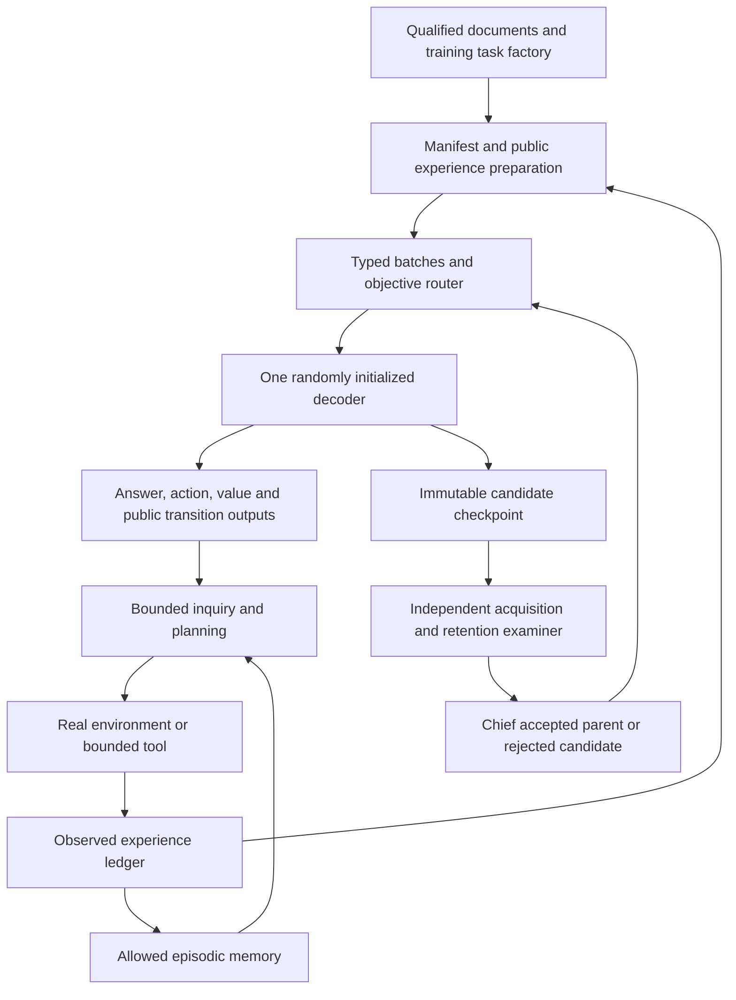

# The integrated learner

All interfaces in this file are target contracts unless explicitly labeled existing. Extend `bramastra_lab/research/`; retain `bramastra_lab/model.py` as the shared decoder implementation. Existing prototype code is useful for reference and controls, but must not become a second training stack.

## 1. Information flow and ownership

The diagram contains two loops with different authority. The inner interaction loop selects observations and actions using public information. The outer training loop may change weights using admitted training experience. The examiner reports evidence; it does not provide hidden answers to either loop. The chief accepts integration and capability claims. Environment internals, oracle solutions and held-out labels stay outside the learned-input boundary.

Every boundary takes a typed value, not an arbitrary dictionary containing an entire experiment object. The canonical public-view adapter must allowlist fields. Audit current `BaseEnvironment._observation`, which includes an episode key in observable values: retain the key in provenance, exclude it from token content. A known family name is a declared public prior only if the task protocol allows it; otherwise omit it. The learner cannot see generator seed, split, hidden mechanism, run UUID, task cluster ID or evaluator verdict.

## 2. Shared core and output contracts

Keep the existing byte tokenizer and tiny/development/future-capacity profiles. These profiles test one implementation at different dimensions; none is a demonstrated sufficient AGI scale. The decoder produces `hidden[B,T,D]` and tied full-vocabulary `logits[B,T,V]`. Reuse the existing action head `[D,1]` and value head `[D,1]` first. Do not add a separate pretrained language model, learned reward judge or opaque planner.

Expose these logical operations through adapters around `IntegratedModel`:

| Operation | Inputs | Outputs and semantics |
|---|---|---|
| `encode_public` | goal, public event prefix, memory context, budget | deterministic token sequence and span/mask map |
| `answer` | encoded prefix and generation allowance | unrestricted token answer, EOS status, costs |
| `score_actions` | one public prefix and K legal candidate serializations | normalized action probabilities and raw scores `[B,K]` |
| `estimate_value` | public prefix ending before action candidates | scalar estimate of the declared extrinsic return |
| `predict_step` | public prefix, one action, protocol output schema | distribution or bounded samples of typed public outcomes |
| `score_answer_distribution` | prefix and a protocol-defined diagnostic answer support | probabilities for inquiry computation, separate from primary free generation |

Keep full-vocabulary logits as the primary language output. Structured prediction can use schema-constrained decoding, but report that constraint and score it separately. A restricted diagnostic answer support must be defined without the current hidden answer; it cannot be used to inflate the primary free-generation result.

### Candidate isolation is mandatory

The current wrapper gathers candidate-span ends from one causal sequence. Concatenated candidates can see earlier candidates; rankings can then depend on enumeration order. The new adapter must evaluate each candidate as an independent branch of the **same** prefix: flatten `[B,K,T]` to independent batch rows, compute each terminal hidden state, then reshape scores. Prefix caching is an optional equivalent optimization after correctness. Do not grant one candidate a different memory or context truncation policy.

Check permutation equivariance, duplicates, padding, illegal candidates and empty candidate sets. Compare equal action identities after permutation, allowing only documented floating-point tolerances. Score the value at the action-free public prefix, not after the last candidate or teacher answer. Terminal actions remain legal only according to the public protocol. Padded action scores never contribute to a loss or a sampled decision.

### Public world model without premature latent complexity

The first world model uses the shared decoder's ordinary token prediction to serialize `next_public_observation`, `feedback`, `terminated` and `truncated`, with schema/version and explicit field boundaries. Known deterministic fields such as remaining budget are computed by the public protocol rather than guessed. Goal reward is recomputed from validated predicted public feedback when the protocol supports this; otherwise a declared reward field is learned from observed reward labels. No hidden-state vector is used as a target.

`predict_step` returns `PredictedOutcome` objects: public payload, probability/log probability, parse validity, unknown probability mass where applicable, predicted termination, model identity and prediction provenance. It never returns a `PublicObservation` receipt. For small finite feedback spaces enumerate the **publicly specified** support and normalize exact sequence scores. For open text, sample bounded continuations; report empirical sample weights and sampling uncertainty. A sample frequency is not an exact posterior. Do not double-count probability for duplicate parses.

A separate latent dynamics network, ensemble, persistent learned memory or recurrent encoder is deferred. Add one only after token-level public prediction has a measured limitation that the new component can address with a controlled comparison. A shared representation does not itself make prediction causally correct.

## 3. State, memory and context

Use three explicitly different stores:

| Store | Scope | Contents | Weight changes? |
|---|---|---|---|
| Working context | One episode/session | Public goal, observations, chosen actions, feedback and remaining allowance | No |
| Episodic memory | An explicitly permitted corpus or training experience snapshot | Content-addressed public records, eligibility metadata and source identities | No |
| Learned parameters | One checkpoint lineage | Decoder and trained heads | Only through the admitted trainer |

Reset working context at episode boundaries. Default evaluation memory is frozen before evaluation and cannot receive other evaluation episodes. A persistent-across-evaluation regime is a different protocol with explicit ordering and reporting; never mix its scores with reset episodes.

First retrieval implementation: deterministic lexical overlap over eligible public text, stable tie break by content hash, fixed top-k and byte/token allowance. This is a disclosed engineered prior. A learned retriever is optional later and must compete against this baseline at equal retrieval cost. Index payloads contain only admissible public content; eligibility, split and cluster metadata are sidecars. Filter before ranking, not after taking the top-k. Exclude current episode, sealed/controller measurement pools as applicable, and prohibited same-mechanism records for transfer tests.

`MemoryContext` contains ordered record hashes, rendered text, token cost, scope, index identity and retrieval rule identity. Cache keys include model/tokenizer/schema/index identities where relevant. A content or permission change invalidates the cache. Checkpoints bind the memory snapshot; they do not silently read whatever mutable directory exists on restore.

Context allocation is deterministic: reserve goal and current observation, action/generation suffix and required structural tokens first; allocate recent events and then retrieved records within the remaining limit. Drop whole optional records, never silently chop an action or structured feedback into an invalid record. Record omitted content IDs. If a required public state cannot fit, return `CONTEXT_OVERFLOW` and count it as a task failure or explicitly unsupported input under the protocol. Do not compare a short-context treatment against a full-history control without declaring the difference.

Memory-free, working-context-only and episodic-retrieval modes use the same model and task instances. They are separate ablations. A knowledge answer copied from stored experience is a retrieval result, not evidence of weight-level acquisition.

## 4. Real experience, imagined branches and teacher traces

`collect` remains the sole normal path from environment transitions into observed experience. Extend its adapter, not the environment's private state. Each step includes before/after public views, selected action identity, legal-action set identity, actual cost, terminal flags, real feedback, behavior-policy identity and selection probabilities when relevant. Failed or invalid actions remain in the observed ledger. Reward labels are generated from actual protocol events, not from the model's own confidence.

Predicted branches go to a separate planning trace. The type system and serializer must reject converting them to observed transitions without a real environment receipt. Hypothetical outcomes may train a separately named distillation experiment only after independent validation; they are excluded from the default world-model dataset. This prevents the learner from treating its own guesses as facts.

Teachers are training-time services with declared capabilities. A symbolic oracle may solve a training world and label an inquiry/action distribution, but the model sees only public prefixes and admitted targets. Teacher provenance includes algorithm identity, hidden-information access, task split, budget and search cost. The examiner's oracle can report an upper bound but cannot teach on sealed instances. Never disguise teacher computation as discovered model reasoning.

## 5. Three execution modes and one trainer

**Offline learning:** verified document/episode shards become masked token, action, value, pair and transition objectives. **Interaction:** a frozen policy/model snapshot observes and acts under real and imagined resource counters. **Candidate adaptation:** admitted training episodes are converted into updates through the same trainer and stored as a child checkpoint. Mode is explicit in every receipt; normal inference never performs surprise optimizer updates.

Avoid a monolithic expansion of `commands.py`. Keep CLI handlers thin and move new orchestration into `orchestration/`, public adapters into `experience/`, and model consumers into `models/`. Shared configuration parsing, checkpoint and trainer changes have one integrator owner. All new schemas reject unknown keys or unsupported versions. Migration must be explicit and preserve source identities; do not load an old checkpoint with newly random heads and call it an exact resume.

Use feature switches for world prediction, action learning, value learning, pair grounding, planning, episodic retrieval, teacher use, replay and plasticity controller. The baseline disables optional mechanisms and remains executable. A switch controls execution and objective routing, not merely display labels. Disabled modules receive no gradients, create no unexpected parameters and consume no undeclared inference budget.

## 6. Operator-facing completion

Expose the existing inspect/prepare/train/resume/infer/evaluate/package path plus implemented adapters for episode preparation, bounded collection, candidate construction and comparison. New command names must be documented as proposed until the parser actually supports them. Every completed command returns a typed status, identities, output locations and consumed resources; unsupported data or hardware receives a specific blocker.

A useful first operator demonstration is one local task session with a checkpoint: inspect the model; provide a public goal; show the chosen inquiry and its cost; accept actual feedback; produce an answer; save the episode; construct an isolated child through a separately invoked training operation; evaluate parent and child; record a promotion decision. Before learned qualification, use deterministic test doubles for orchestration and clearly label random-model demonstrations. A successful UI transcript is not the final intelligence test.
